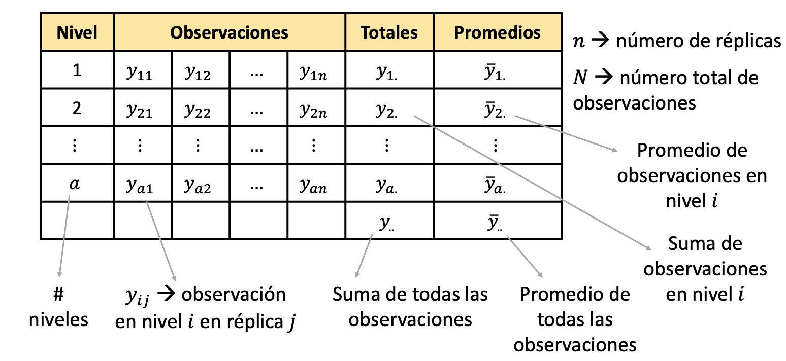
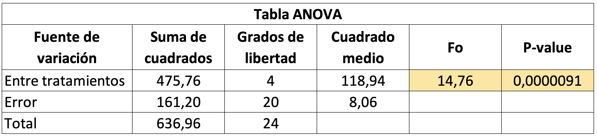

```{r setup, include=FALSE}
knitr::opts_chunk$set(echo = TRUE)
```

Un diseño de experimento de un solo factor es un tipo de estudio
experimental en el que se analiza la influencia de un único factor sobre
una variable de respuesta. Este factor se define como la variable
independiente, mientras que la variable de respuesta es la variable
dependiente.

**Conceptos básicos**

-   Factores: Fenómenos que potencialmente causan variación y que se
    pueden fijar en un valor dado.
-   Niveles: Valores que un factor puede tomar.
-   Tratamieto: Combinación de niveles de todos los factores
    involucrados en el experimento.
-   Variable de respuesta: Se mide el efecto del factor sobre una
    variable dependiente.
-   Experimento balanceado: Experimento en que todos los niveles
    aparecen el mismo número de veces.

# Análisis de varianza (ANOVA)

Es una técnica estadística que se utiliza en el diseño de experimentos
(DOE) para comparar las medias de dos o más grupos. En un DOE de un
factor, se analiza la influencia de un **único factor** sobre una
variable de respuesta.

**Objetivo:**

-   Evaluar si existe una diferencia significativa entre las medias de los diferentes niveles del factor.
-   Determinar si el factor tiene un efecto significativo sobre la variable de respuesta.

**Componentes del ANOVA:**

-   Factor: Variable independiente que se modifica en el experimento.
-   Niveles: Categorías o valores específicos del factor.
-   Variable de respuesta: Variable dependiente que se mide en el
    experimento.
-   Modelo lineal: Se utiliza para describir la relación entre el factor
    y la variable de respuesta.
-   Suma de cuadrados: Mide la variabilidad dentro y entre los grupos.
-   Grados de libertad: Indica el número de valores independientes en
    cada conjunto de datos.
-   Media cuadrática: Estima la varianza dentro y entre los grupos.
-   Razón F: Se utiliza para comparar la varianza entre los grupos con
    la varianza dentro de los grupos.
-   Valor p: Indica la probabilidad de obtener una razón F tan grande o
    más grande por casualidad.

**Interpretación de resultados:**

-   Si el valor p es menor que el nivel de significancia ($\alpha$), se
    rechaza la hipótesis nula y se concluye que existe una diferencia
    significativa entre las medias de los diferentes niveles del factor.

-   Si el valor p es mayor que el nivel de significancia ($\alpha$), no
    se rechaza la hipótesis nula y no se puede concluir que existe una
    diferencia significativa.

[***Se comparan medias pero se usan las varianzas ...***]{.underline}

<div style="text-align: justify">

La idea general de esta técnica es separar la variación total en las
partes con las que contribuye cada fuente de variación en el
experimento. En este sentido, se separan la variabilidad debida a los
tratamientos y la debida al error. Cuando la primera predomina
“claramente” sobre la segunda, es cuando se concluye que los
tratamientos tienen efecto, o dicho de otra manera, las medias son
diferentes. Cuando los tratamientos no dominan (contribuyen igual o
menos que el error), se concluye que las medias son iguales, es decir,
no tiene efecto.

<div/>

::: {style="text-align:center"}
{width="558"}
:::

Ahora bien, el objetivo del análisis de varianza es probar la hipótesis
de igualdad de los tratamientos con respecto a la media de la
correspondiente variable de respuesta:

$$ H_0: \mu_1=\mu_2 = ... = \mu_n = \mu$$
$$H_1: \mu_i \neq \mu_j  \text{    para algún      } i \neq j$$ la cual
se puede escribir en forma equivalente en forma de efecto como:

$$ H_0: \tau_1=\tau_2 = ... = \tau_k = 0$$
$$H_1: \tau_i \neq 0  \text{    para algún      } i$$ donde $\tau_i$ es
el efecto del tratamiento $i$ sobre la variable de respuesta. Si se
acepta $H_0$, se confirma que los efectos sobre la respuesta de los $k$
tratamientos son estadísticamente nulos (iguales a cero), y en caso de
rechazar se estaría concluyendo que al menos un efecto es diferente de
cero.

Ahora bien, si comparamos las hipótesis para la media y para los efectos
se deduce que:

$$ \mu_i - \mu =\tau_i\  \ \ \ \ \ \  \ \forall i$$

Lo cual representa el efecto del tratamiento $i$,esto es la distancia
entre la respuesta media del tratamiento, $\mu_i$, y la respuesta media
global, $\mu$; y cuando un efecto es igual a cero, equivale a decir que
la media del tratamiento correspondiente es igual a la media global.
Así, se observa que para que todas las respuestas medias de tratamientos
sean iguales a la respuesta media global, $\mu$, representada por la
línea horizontal, se requiere que todos los efectos $\tau_i$ sean
iguales a cero.

::: {style="text-align:center"}
{width="435"}
:::

Para probar la hipótesis planteandas mediante la técnica de ANOVA, se
debe separar la variabilidad total de los datos. Para ello se tiene que
una medida de la variabilidad total presente en las observaciones de la
siguiente tabla:

::: {style="text-align:center"}
{width="445"}
:::

Es la suma total de cuadrados dada por:

$$SST=\sum_{i=1}^{a}\sum_{j=1}^{n_i}(y_{ij}-\overline{y}_{..})^2=\sum_{i=1}^{a}\sum_{j=1}^{n_i}y^2_{ij}-\frac{y^2_{..}}{N} $$

Por lo tanto, la partición de la variabilidad global es:

$$\sum_{i=1}^{a}\sum_{j=1}^{n_i}(y_{ij}-\overline{y}_{..})^2=n_i\sum_{i=1}^{a}(\overline{y}_{i.}-\overline{y}_{..})^2+\sum_{i=1}^{a}\sum_{j=1}^{n_i}(y_{ij}-\overline{y}_{i.})^2 $$

Donde el primer componente es la suma de cuadrados de tratamientos
($SS_{Tratamiento}$) y el segundo es la suma de cuadrados del error
($SSE$). Al observar con detalle estas sumas de cuadrados, se aprecia
que la $SS_{Tratamiento}$ mide la variación o diferencias entre
tratamientos, ya que si éstos son muy diferentes entre sí, entonces la
diferencia $y_{i.}-\overline{y}_{..}$ tenderá a ser grande en valor
absoluto, y con ello también será grande la $SS_{Tratamiento}$. Por su
parte, la $SSE$ mide la variación dentro de tratamientos, ya que si hay
mucha variación entre las observaciones de cada tratamiento, entonces
$y_{ij}-\overline{y}_{i.}$ tenderá a ser grande en valor absoluto. En
forma abreviada, esta descomposición de la suma total de cuadrados se
puede escribir como:

$$SST = SS_{Tratamiento}+SS_E$$

Como hay un total de N observaciones, la $SST$ tiene $N – 1$ grados de
libertad. Hay $a$ tratamientos o niveles del factor de interés, así que
$SS_{Tratamiento}$ tiene $a – 1$ grados de libertad, mientras que la
$SS_E$ tiene $N – a$.

Por otra parte, las sumas de cuadrados divididas entre sus respectivos
grados de libertad se llaman cuadrados medios, y es una estimación de la
magnitud de su correspondiente fuente de variabilidad. Los dos que más
interesan son el cuadrado medio de tratamientos y el cuadrado medio del
error, que se denotan por:

$$MS_{tratamiento}=\frac{SS_{Tratamiento}}{a-1}$$ y,
$$MS_{E}=\frac{SS_E}{N-a}$$

Los valores esperados de los cuadrados medios están dados por:

$$E(MS_E)=\sigma^2$$ y,

$$E(MS_{tratamiento})=\sigma^2+\frac{\sum_{i=1}^{a}n_i*\tau^2_i}{N-a}$$

<div style="text-align: justify">

En estas expresiones se aprecia que cuando la hipótesis nula es
verdadera, ambos cuadrados medios estiman la varianza $\sigma^2$, ya que
el segundo término de la expresión para el $E(MS_{tratamiento})$ sería
igual a cero. Con base en este hecho se construye el estadístico de
prueba como sigue:

$$F_0=\frac{MS_{tratamiento}}{MS_E}$$

La cual sigue una distribución $F$ de fisher con $(a – 1)$ grados de
libertad en el numerador y $(N – a)$ grados de libertad en el
denominador. Donde se deduce que si $F_0$ es grande, se contradice la
hipótesis de que no hay efectos de tratamientos; en cambio, si $F_0$ es
pequeño, se confirma la validez de $H_0$. Así, para un nivel de
significancia predefinido, se rechaza $H_0$ si
$F_0 > F_{\alpha, a -1, N – a}$, donde $F_{\alpha, a -1, N – a}$ es el
percentil $(1 – \alpha) *100$ de la distribución F. También se rechaza
$H_0$ si el $valor-p < \alpha$, donde el valor-p es el área bajo la
distribución $F_{a -1, N – a}$ a la derecha del estadístico $F_0$, es
decir, el valor-p = $P(F > F_0)$ es la significancia observada. Las
fórmulas simplificadas para calcular el estadístico $F_0$ hasta llegar
al valor-p se escribe en la llamada tabla de análisis de varianza
(ANOVA) que se muestra en la siguiente tabla:

<div/>

::: {style="text-align:center"}
{width="544"}
:::

**Estimación de los parámetros**

A continuación presentamos los estimadores de los parámetros del modelo
con un solo factor:

-   Estimador de la media global:

$$ \hat{\mu} = \overline{y}_{..}$$

-   Estimador de la media del tratamiento $i$.

$$ \hat{\mu_i} = \overline{y}_{i.}$$

-   Estimador del efecto del tratamiento $i$.

$$ \hat{\tau_i} = \overline{y}_{i.} - \overline{y}_{..}$$

-   Intervalo de confianza para $\mu_i$:

$$\overline{y}_{i.} - t_{(\frac{\alpha}{2},N-a)}\sqrt{\frac{MS_E}{n}} \leq \mu_i \leq \overline{y}_{i.} + t_{(\frac{\alpha}{2},N-a)}\sqrt{\frac{MS_E}{n}}$$

-   Intervalo de confianza para la diferencia de medias:

$$(\overline{y}_{i.}- \overline{y}_{j.})- t_{(\frac{\alpha}{2},N-a)}\sqrt{\frac{2MS_E}{n}} \leq \mu_i -\mu_j \leq (\overline{y}_{i.}- \overline{y}_{j.})+ t_{(\frac{\alpha}{2},N-a)}\sqrt{\frac{2MS_E}{n}}$$

## Ejemplo 1

Un ingeniero está interesado en investigar el efecto del peso porcentual
del algodón sobre la resistencia a la tensión ($lb/in^2$) de una nueva
fibra para fabricar tela. Se Sabe que el contenido de algodón debe
variar entre 10% y 40%, así que decide probar ejemplares en cinco
niveles del peso porcentual del algodón: 15, 20, 25, 30 y 35 por ciento.
También decide probar cinco ejemplares en cada nivel del contenido de
algodón. Los datos del experimento se presentan en la siguiente tabla:

::: {style="text-align:center"}
{width="724"}
:::

**Solución**

-   **Paso 1**: Encontramos las sumas y los promedios por tratamiento,
    esto es: $y_{i.}$ y $\overline{y}_{i.}$. También, las sumas y
    promedios totales, esto es: $y_{..}$ y $\overline{y}_{..}$.

::: {style="text-align:center"}
{width="718"}
:::

-   **Paso 2**: Encontramos los $SS_{tratamiento}$ $SS_T$, y $SS_E$.

$$SS_{tratamiento} = n_i\sum_{i=1}^{a}(\overline{y}_{i.}-\overline{y}_{..})^2=5[(9.8-15.04)^2+(15.4-15.04)^2+(17.6-15.04)^2+(21.6-15.04)^2+(10.8-15.04)^2]=475.76$$
$$SS_T= \sum_{i=1}^{a}\sum_{j=1}^{n_i}(y_{ij}-\overline{y}_{..})^2= (7-15.04)^2+(12-15.04)^2+ ... +(11-15.04)^2=636.96$$
$$SS_E= SS_T - SS_{tratamiento}= 636.96-475.76=161.20$$ - **Paso 3**:
Hallamos los grados de libertad para cada fuente de variación anterior.

para el tratamiento:

$$a-1= 5-1= 4$$ Para el error:

$$ N-a = 25-5= 20$$ Para la suma total:

$$N-1= 25-1 =24$$

-   **Paso 4**: Hallamos loas cuadrados medios

$$MS_{tratamiento}= \frac{SS_{Tratamiento}}{a-1} = \frac{475.76}{4} = 118.94$$
$$MS_{E}=\frac{SS_E}{N-a}= \frac{161.20}{20}=8.06$$

-   **Paso 5**: Hallamos $F_0$

$$F_0=\frac{MS_{tratamiento}}{MS_E}=\frac{118.94}{8.06}=14.76$$

-   **Paso 6**: Hallamo el p-valor, esto es: $P(F>F_0)$, donde
    $F_{\alpha, a -1, N – a}$

En particular, $P(F>F_0)=0.0000091$

El resumen de los calculos realizados se muestra en la siguiente tabla:

::: {style="text-align:center"}
{width="616"}
:::

-   **Paso 7**: Conclusión de los resultados

Dado que $p-valor < \alpha$, rechazamos $H_0$, es decir al menos una
media es diferente.En otras palabras, el peso porcentual del algodol
incide en la resistencia a la tensión.

-   **Paso 8**: Estimamos los parámetros

-   Estimador de la media global:

$$ \hat{\mu} = \overline{y}_{..}= 15.04$$

-   Estimador de la media del tratamiento $i$.

$$ \hat{\mu_1} = \overline{y}_{1.}=9.8$$
$$ \hat{\mu_2} = \overline{y}_{2.}=15.4$$
$$ \hat{\mu_3} = \overline{y}_{3.}=17.6$$
$$ \hat{\mu_4} = \overline{y}_{4.}=21.6$$
$$ \hat{\mu_4} = \overline{y}_{4.}=10.8$$

-   Estimador del efecto del tratamiento $i$.

$$ \hat{\tau_1} = \overline{y}_{1.} - \overline{y}_{..} = 9.8 -15.04 = -5.24$$
$$ \hat{\tau_2} = \overline{y}_{2.} - \overline{y}_{..}=15.4 - 15.04 = 0.36$$
$$ \hat{\tau_3} = \overline{y}_{3.} - \overline{y}_{..}=17.6-15.04=2.56$$
$$ \hat{\tau_4} = \overline{y}_{4.} - \overline{y}_{..}= 21.6-15.04=6.56$$
$$ \hat{\tau_5} = \overline{y}_{5.} - \overline{y}_{..}=  10.8 -15.04=-4.24$$

-   Intervalo de confianza para $\mu_i$:

$$\overline{y}_{i.} - t_{(\frac{\alpha}{2},N-a)}\sqrt{\frac{MS_E}{n}} \leq \mu_i \leq \overline{y}_{i.} + t_{(\frac{\alpha}{2},N-a)}\sqrt{\frac{MS_E}{n}}$$
Para el tratamiento 1:
$$9.8 - 2.08\sqrt{\frac{8.06}{5}} \leq \mu_1 \leq 9.8 + 2.08\sqrt{\frac{8.06}{5}}$$
$$7.15 \leq \mu_1 \leq 12.45$$ Análogamente para el tratamiento 2:

$$12.75 \leq \mu_2 \leq 18.05$$ Para el tratamiento 3:

$$14.95 \leq \mu_3 \leq 20.25$$ Para el tratamiento 4:

$$18.95 \leq \mu_4 \leq 24.25$$ Para el tratamiento 5:

$$8.15 \leq \mu_4 \leq 13.45$$

-   **Usando R**

Incialmente, se construye el dataframe de los datos

```{r Eje1, echo=TRUE}

#Creamos el dataframe

peso <-c(15,15,15,15,15,20,20,20,20,20,25,25,25,25,25,30,30,30,30,30,35,35,35,35,35)
resistencia <-c(7,7,15,11,9,12,17,12,18,18,14,18,18,19,19,19,25,22,19,23,7,10,11,15,11)

datos<-data.frame(peso,resistencia)
datos$peso <- as.factor(datos$peso)

#Mostramos la estructura de los datos
str(datos)

```

Antes de iniciar la etapa de la construcción del anova, en R podemos
revisar descriptivamente si hay una diferencia entre las medias de los
niveles estudiantes, esto es:

```{r Eje11, echo=TRUE}

## boxplots para revisar efectos
boxplot(resistencia ~ peso, data = datos, las = 1, col = 2:4, xlab = 'peso', ylab = 'resistencia')
```

Tal como se observa en el gráfico, se puede sospechar que hay
diferencias entre los niveles del factor Peso.

Ahora construimos la tabla ANOVA:

```{r Eje15, echo=TRUE}

## ANOVA
fitdisplay <- lm(resistencia ~ peso, data = datos)
anova(fitdisplay)

```

La conclusión de la tabla ANOVA es que existe al menos un tipo de
porcentaje de peso para el que las resitencias promedio son superiores o
inferiores a los demás. En otras palabras, esto indica que la variable
peso si afecta las resistencias del producto de interes. Aunque este
resultado es importante, por lo general interesa determinar la magnitud
del efecto de cada nivel de peso sobre la resistencia. Esto es posible a
partir del objeto fitdisplay. Para ello utilizamos los estimadores de
máxima verosimilitud obtenidos al emplear el método de mínimos cuadrados
ordinarios en el modelo regresión Lineal Simple:

```{r Eje16, echo=TRUE}

## lineal regression
summary(fitdisplay)

```

A partir de este resultado concluimos que utilizar el peso de 30% mejora
considerablemente la resistencia respecto al peso del 15%. En
particular, utilizar el un peso de 30% en lugar del 15% incrementa la
resistencia en un 11.8%.

Ahora bien, para estimar el estimador de la media global, estimador del
efecto del tratamiento $i$, y estimador del efecto del tratamiento $i$.
Se sigue lo siguiente:

```{r Eje12, echo=TRUE}

#Calculamos las medias (Estimadores por tratamiento)
## measures using tapply
with(datos, tapply(resistencia, peso, mean))

```

```{r Eje13, echo=TRUE}

#Efectos de cada tratamiento
with(datos, tapply(resistencia, peso, mean))-mean(datos$resistencia)

```

```{r Eje14, echo=TRUE}

#Media Global
mean(datos$resistencia)

```

Que podemos decir acerca de la comparación de los diferentes pesos Para
responder a esto utilizamos una comparación ad hoc. Esta comparación
puede hacerse utilizando la prueba de mínima diferencia significativa de
Tukey:

```{r Eje17, echo=TRUE}

## Least Singificant Difference (LSD) test
anova <- aov(fitdisplay)
(lsd <- TukeyHSD(anova, "peso", ordered = TRUE))


```

Los resultados indican que la diferencia 20-15, 25-15, 30-15, 25-35,
30-35, y 30-20 son estadísticamente significativas después de
correcciones por múltiples comparaciones, es decir, que la columna p-adj
es \< 0.05, donde este último valor corresponde a la probabilidad de
Error Tipo I.

Para visualizar dichas diferencias utilizamos la función plot sobre el
objeto lsd:

```{r Eje18, echo=TRUE, fig.height=10}
## LSD plot
plot(lsd)
```

La conclusión es la misma que obtuvimos al analizar los resultados
numéricos.

Finalmente, los intervalos de confianza se pueden calcular con el
siguiente código para cada tratamiento:

```{r Eje24, echo=TRUE, fig.height=10}
## Intervalos de confianza

calcular_intervalo_confianza <- function(promedio,mse,grados_libertad,n, confianza = 0.95) {
  error_estandar <- sqrt(mse/n)
  t_valor <- qt((1 + confianza) / 2, df = grados_libertad)  # Valor crítico de t
  
  margen_error <- t_valor * error_estandar
  limite_inferior <- promedio - margen_error
  limite_superior <- promedio + margen_error
  
  return(c(limite_inferior, limite_superior))
}
resumen_modelo<-summary(fitdisplay)
mse <-resumen_modelo$sigma^2
promedio <- with(datos, tapply(resistencia, peso, mean))
n <- 5
grados_libertad <- 20

for (i in 1:n) {
  intervalos_confianza<-calcular_intervalo_confianza(promedio[i],mse,grados_libertad,n)
  cat("Intervalo de confianza para el tratamiento", i,": [",intervalos_confianza[1],",",intervalos_confianza[2], "]\n")
}


```

# Supuestos

La validez de los resultados obtenidos en cualquier análisis de varianza
queda supeditado a que los supuestos del modelo se cumplan. Estos
supuestos son: normalidad, varianza constante (igual varianza de los
tratamientos) e independencia. Esto es, la respuesta ($Y$) en cada
tratamiento se debe distribuir de manera normal, con la misma varianza
en cada tratamiento, y las mediciones deben ser independientes. Estos
supuestos sobre $Y$ se traducen en supuestos sobre el término error
($\varepsilon$) en el mo- delo.Es una práctica común utilizar la muestra
de residuos para comprobar los supuestos del modelo, ya que si los
supuestos se cumplen, los residuos o residuales se pueden ver como una
muestra aleatoria de una distribución normal con media cero y varianza
constante. Los residuos, $\varepsilon_{ij}$, se definen como la
diferencia entre la respuesta observada ($y_{ij}$) y la respuesta
predicha por el modelo ($\widehat{y_{ij}}$), lo cual permite hacer un
diagnóstico más directo de la calidad del modelo, ya que su magnitud
señala qué tan bien el modelo describe los datos.

En general, En DOE de un factor al igual que los otros DOE, se tienen
los siguientes supuestos sobre el error aleatorio, $\varepsilon$:

1.  $\mu_\varepsilon= 0$, donde $\mu_\varepsilon$ es la media de $\varepsilon$. (Linealidad)

2.  $\varepsilon_1, \varepsilon_2, ... , \varepsilon_n$ tiene varianza constante $\sigma^2$ (Homocedasticidad)

3.  $\varepsilon \sim N(0,\sigma^2)$ (Normalidad)

4.  $\varepsilon_i$ y  $\varepsilon_j$ son independientes para $i \neq j$


En R dicha validación se realiza sobre los residuales del modelo ajustado. En nuestro caso, este modelo está contenido en el objeto fitdidisplays.

```{r Eje20, echo=TRUE, fig.height=10,message=FALSE}
require(car)
## calcular los residuals
r <- rstudent(fitdisplay)

```

## Normalidad

Para la prueba de normalidad de utiliza el Q-Q plot y la prueba de Shapiro-Wilk. En el caso del plot Q-Q se debe observar que los puntos sigan la línea recta para comprobar la normalidad en los residuos. Para el Caso del Test de Shapiro-Wilk se valida que $H_0:$ Los datos proceden de una distribución normal, donde se concluye que sigue una distribución normal si el $P-value > \alpha$. 

```{r Eje21, echo=TRUE}
## Supuesto de  normalidad
shapiro.test(r)
#Graficamente
qqnorm(r, las = 1)
qqline(r, col = 1, lty = 2)
```


Para este caso en particula, se cumple el supuesto de normalidad, dado a que p-values es igual a 0.4917

## Homocedasticidad

Para el caso de la prueba de varianza constate (Homocedasticidad), se utiliza el test de Barlett, Donde se valida $H_0:$ la varianza es constante, donde se concluye qe hay homocedasticidad en los residuos si el $P-value > \alpha$. 

```{r Eje19, echo=TRUE}
## varianza constante usando Breusch-Pagan
car:::ncvTest(fitdisplay)
bartlett.test(datos$resistencia ~ datos$peso)
```

Para este caso en particula, se cumple el supuesto de homocedasticidad, dado a que p-values es igual a 0.919

## Independencia de los errores

Una prueba analítica para verificar la independencia entre residuos consecutivos es la prueba de Durbin-Watson. Para validar el suspuesto de independencia de errores en los residuos el $P-value > \alpha$. 

```{r Eje23, echo=TRUE}
## Durbin-Watson (Prueba de independencia dee errores)
durbinWatsonTest(fitdisplay)
```
Para este caso en particula, se cumple el supuesto de independencia de errores, dado a que p-values es igual a 0.806.

Gráficamente, podemos validar los supuestos con los siguientes plots:

```{r Eje22, echo=TRUE}
# r vs. x1
par(mfrow = c(1, 2), mai = c(0.65, 0.65, .65, .65))
plot(r, las = 1, ylab = 'Residual', xlab = "Observation #", main = 'Residuals')
abline(h = 0, col = 2, lty = 2)
# r vs. x3
boxplot(r ~ datos$peso, las = 1, ylab = 'Residual', xlab = "Peso", main = "Peso")
abline(h = 0, col = 2, lty = 2)

## independence using ACF
acf(r, las = 1, main = "")
mtext("ACF", side = 3, line = .2)
```

Estos resultados indican que los errores del modelo ajustado son independientes, siguen una distribución normal y tienen varianza constante. Por lo tanto, el modelo y las conclusiones que se deriven de él son valida.
