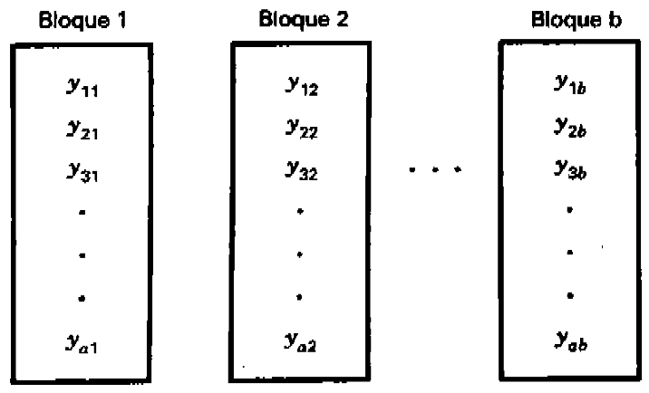
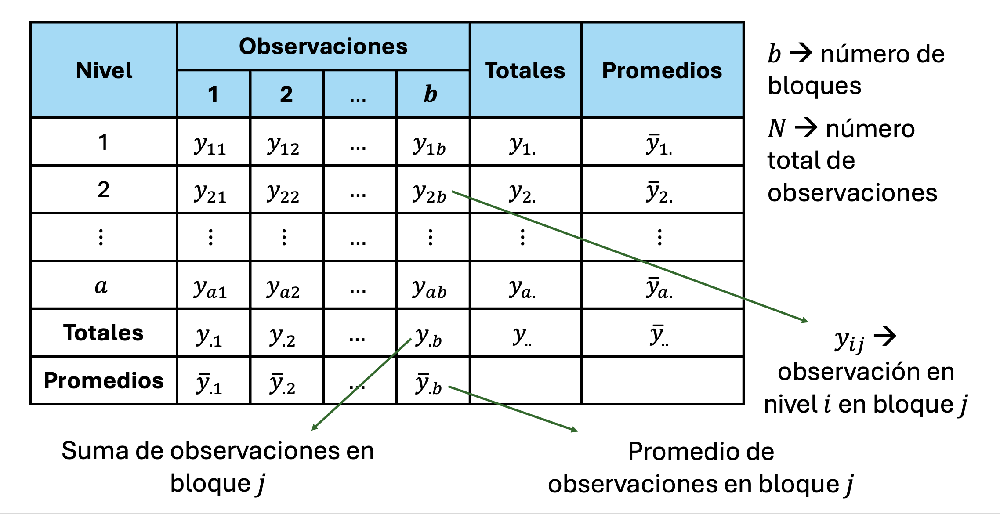
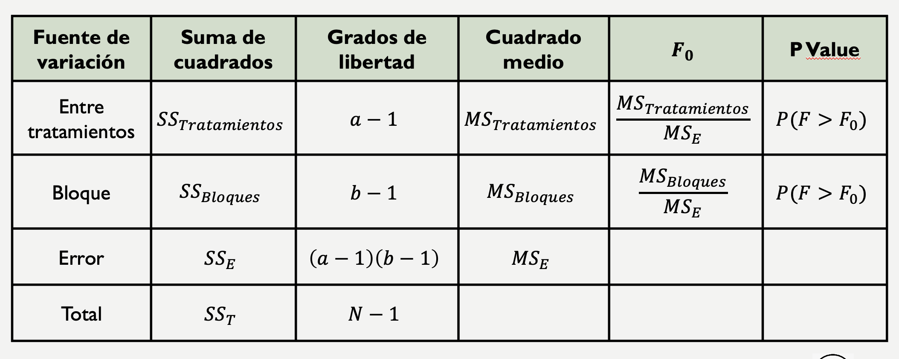
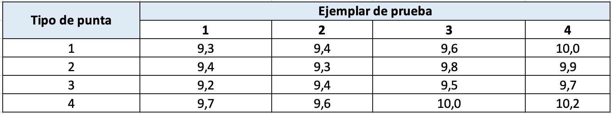
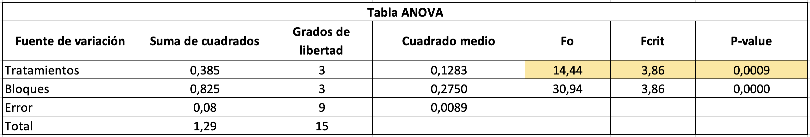

```{r setup, include=FALSE}
knitr::opts_chunk$set(echo = TRUE)
```

Los experimentos de un solo factor con bloques aleatorizados son un tipo
específico de diseño experimental que combina las características de los
experimentos de un solo factor con la técnica de bloques aleatorizados.
En este tipo de experimento, el factor de interés (variable
independiente) se manipula mientras se controlan otras variables que
podrían influir en los resultados. Sin embargo, a diferencia de un
diseño típico de un solo factor, los sujetos o unidades experimentales
se agrupan en bloques homogéneos basados en una variable de control
relevante.

Por ejemplo, si estamos estudiando el efecto de diferentes tipos de
fertilizantes en el crecimiento de plantas, podríamos agrupar las
parcelas de tierra en bloques según su nivel de exposición al sol, y
luego asignar aleatoriamente los tratamientos de fertilizantes dentro de
cada bloque. Esto ayuda a reducir la variabilidad experimental al tener
en cuenta factores que podrían influir en los resultados.

Los experimentos de un solo factor con bloques aleatorizados permiten
una mejor precisión en la estimación del efecto del factor de interés al
controlar más eficazmente la variabilidad experimental. Esto los hace
especialmente útiles en situaciones donde hay factores adicionales que
podrían afectar los resultados y que pueden ser controlados o medidas en
bloques.

**Conceptos básicos**

-   Factores: Fenómenos que potencialmente causan variación y que se
    pueden fijar en un valor dado.
-   Niveles: Valores que un factor puede tomar.
-   Tratamieto: Combinación de niveles de todos los factores
    involucrados en el experimento.
-   Variable de respuesta: Se mide el efecto del factor sobre una
    variable dependiente.
-   Experimento balanceado: Experimento en que todos los niveles
    aparecen el mismo número de veces.
-   Factor perturbador: Factor que puede tener un efecto sobre la
    respuesta, pero en el que no se tiene un interés particular. Puede
    ser: (a) desconocido y no controlable o (b) conocido y controlable.

## Bloques

A los factores adicionales al factor de interés que se incorporan de
manera explícita en un experimento comparativo se les llama factores de
bloque. Éstos tienen la particularidad de que se incluyen en el
experimento no porque interese analizar su efecto, sino como un medio
para estudiar de manera adecuada y eficaz el factor de interés. Los
factores de bloque entran al estudio en un nivel de importancia
secundaria con respecto al factor de interés y, en este sentido, se
puede afirmar que se estudia un solo factor, porque es uno el factor de
interés.

**Algunas particularidades**

-   Se tienen 𝑎 tratamientos a comparar y 𝑏 bloques.

-   Una observación por tratamiento en cada bloque y el orden de
    corridas dentro de cada bloque es aleatorio.

-   Los bloques representan una restricción sobre la aleatorización.

::: {style="text-align:center"}
{width="347"}
:::

En un diseño en bloques completos al azar (DBCA) se consideran tres
fuentes de variabilidad: el factor de tratamientos, el factor de bloque
y el error aleatorio, es decir, se tienen tres posibles “culpables” de
la variabilidad presente en los datos. La palabra completo en el nombre
del diseño se debe a que en cada bloque se prueban todos los
tratamientos, o sea, los bloques están completos. La aleatorización se
hace dentro de cada bloque; por lo tanto, no se realiza de manera total
como en el diseño completamente al azar. El hecho de que existan bloques
hace que no sea práctico o que incluso sea imposible aleatorizar en su
totalidad.

# Análisis de varianza (ANOVA)

El análisis de varianza (ANOVA) es una técnica estadística comúnmente
utilizada en experimentos de un solo factor con bloques aleatorizados
para determinar si existen diferencias significativas entre los niveles
del factor de interés en términos de su efecto sobre la variable
dependiente. El ANOVA descompone la variabilidad total observada en el
conjunto de datos en componentes atribuibles a diferentes fuentes de
variación, como el efecto del factor, la variación entre bloques y la
variación dentro de los bloques.

**Objetivo:**

-   Determinar con precisión el efecto del factor de interés sobre la
    variable dependiente, mientras se controlan otras fuentes de
    variabilidad que podrían influir en los resultados.

**Componentes del ANOVA:**

-   Factor: Variable independiente que se modifica en el experimento.
-   Niveles: Categorías o valores específicos del factor.
-   Variable de respuesta: Variable dependiente que se mide en el
    experimento.
-   Modelo lineal: Se utiliza para describir la relación entre el factor
    y la variable de respuesta.
-   Suma de cuadrados total (SST): Es la variabilidad total en los datos
    y se calcula como la suma de las diferencias al cuadrado entre cada
    observación y la media general de todas las observaciones.
-   Suma de cuadrados del factor ($SS_{tratamiento}$): Representa la
    variabilidad entre los niveles del factor de interés y se calcula
    como la suma de las diferencias al cuadrado entre la media de cada
    nivel del factor y la media general de todos los datos, ponderada
    por el número de observaciones en cada nivel.
-   Suma de cuadrados de los bloques (SSB): Representa la variabilidad
    entre los bloques y se calcula como la suma de las diferencias al
    cuadrado entre la media de cada bloque y la media general de todos
    los datos, ponderada por el número de observaciones en cada bloque.
-   Suma de cuadrados del error (SSE): Es la variabilidad dentro de los
    bloques y se calcula como la suma de las diferencias al cuadrado
    entre cada observación y la media de su respectivo bloque.
-   Grados de libertad: Indica el número de valores independientes en
    cada conjunto de datos.
-   Media cuadrática: Estima la varianza dentro y entre los grupos.
-   Razón F: Se utiliza para comparar la varianza entre los grupos con
    la varianza dentro de los grupos.
-   Valor p: Indica la probabilidad de obtener una razón F tan grande o
    más grande por casualidad.

**Interpretación de resultados:**

-   Si el valor p es menor que el nivel de significancia ($p < \alpha$),
    entonces se rechaza la hipótesis nula. Esto sugiere que las
    diferencias observadas entre los grupos son estadísticamente
    significativas, lo que indica que al menos uno de los grupos difiere
    significativamente de los demás.

-   Si el valor p es mayor que el nivel de significancia ($p ≥ \alpha$),
    entonces no se rechaza la hipótesis nula. En este caso, no hay
    evidencia suficiente para concluir que existen diferencias
    significativas entre los grupos comparados.

## Hipótesis

Ahora bien, el objetivo del análisis de varianza es probar la hipótesis
de igualdad de los tratamientos con respecto a la media de la
correspondiente variable de respuesta:

$$ H_0: \mu_1=\mu_2 = ... = \mu_n = \mu$$
$$H_1: \mu_i \neq \mu_j  \text{    para algún      } i \neq j$$ la cual
se puede escribir en forma equivalente en forma de efecto como:

$$ H_0: \tau_1=\tau_2 = ... = \tau_k = 0$$
$$H_1: \tau_i \neq 0  \text{    para algún      } i$$ donde $\tau_i$ es
el efecto del tratamiento $i$ sobre la variable de respuesta. Si se
acepta $H_0$, se confirma que los efectos sobre la respuesta de los $k$
tratamientos son estadísticamente nulos (iguales a cero), y en caso de
rechazar se estaría concluyendo que al menos un efecto es diferente de
cero.

Ahora bien, si comparamos las hipótesis para la media y para los efectos
se deduce que:

$$ \mu_i - \mu =\tau_i\  \ \ \ \ \ \  \ \forall i$$

Lo cual representa el efecto del tratamiento $i$,esto es la distancia
entre la respuesta media del tratamiento, $\mu_i$, y la respuesta media
global, $\mu$; y cuando un efecto es igual a cero, equivale a decir que
la media del tratamiento correspondiente es igual a la media global.
Así, se observa que para que todas las respuestas medias de tratamientos
sean iguales a la respuesta media global, $\mu$, representada por la
línea horizontal, se requiere que todos los efectos $\tau_i$ sean
iguales a cero.

Ahora bien, para probar la hipótesis planteandas mediante la técnica de
ANOVA, se debe separar la variabilidad total de los datos. Para ello se
tiene que una medida de la variabilidad total presente en las
observaciones de la siguiente tabla:

::: {style="text-align:center"}
{width="582"}
:::

En este sentido,la suma total de cuadrados dada por:

$$SST=\sum_{i=1}^{a}\sum_{j=1}^{n_i}(y_{ij}-\overline{y}_{..})^2=\sum_{i=1}^{a}\sum_{j=1}^{n_i}y^2_{ij}-\frac{y^2_{..}}{N} $$

Por lo tanto, la partición de la variabilidad global es:

$$\sum_{i=1}^{a}\sum_{j=1}^{n_i}(y_{ij}-\overline{y}_{..})^2=b\sum_{i=1}^{a}(\overline{y}_{i.}-\overline{y}_{..})^2+a\sum_{j=1}^{b}(\overline{y}_{.j}-\overline{y}_{..})^2+\sum_{i=1}^{a}\sum_{j=1}^{b}(y_{ij}-\overline{y}_{i.}-\overline{y}_{.j}+\overline{y}_{..})^2 $$
Donde,

$$SS_{Tratamiento}=b\sum_{i=1}^{a}(\overline{y}_{i.}-\overline{y}_{..})^2=\frac{1}{b}\sum_{i=1}^{a}\sum_{j=1}^{n_i}y^2_{i.}-\frac{y^2_{..}}{N}$$

$$SS_{Bloques}=a\sum_{j=1}^{b}(\overline{y}_{.j}-\overline{y}_{..})^2=\frac{1}{a}\sum_{i=1}^{a}\sum_{j=1}^{n_i}y^2_{.j}-\frac{y^2_{..}}{N}$$
y,

$$SS_{E}=SST-SS_{Tratamiento}-SS_{Bloques} $$

Como hay un total de N observaciones, la $SST$ tiene $N – 1$ grados de
libertad. Hay $a$ tratamientos y $b$ bloques, entonces
$SS_{Tratamiento}$ y $SS_{bloques}$ tienen $a – 1$ y $b – 1$ grados de
libertad, respectivamente. Finalmente, el $SS_E$ tiene $(a-1)(b-1)$
grados de libertad.

Por otra parte, las sumas de cuadrados divididas entre sus respectivos
grados de libertad se llaman cuadrados medios, y es una estimación de la
magnitud de su correspondiente fuente de variabilidad. Las tres que más
interesan son el cuadrado medio de tratamientos, el cuadrado medio del
bloque y el cuadrado medio del error, que se denotan por:

$$MS_{tratamiento}=\frac{SS_{Tratamiento}}{a-1}$$
$$MS_{bloque}=\frac{SS_{bloque}}{b-1}$$

y, $$MS_{E}=\frac{SS_E}{(a-1)(b-1)}$$ Con base a lo anterior se
construye los estadísticos de prueba como sigue:

$$F_0=\frac{MS_{tratamiento}}{MS_E}$$

$$F_0=\frac{MS_{bloques}}{MS_E}$$

La cual sigue una distribución $F$ de fisher con $(a – 1)$ grados de
libertad en el numerador y $(a-1)(b-1)$ grados de libertad en el
denominador. Donde se deduce que si $F_0$ es grande, se contradice la
hipótesis de que no hay efectos de tratamientos; en cambio, si $F_0$ es
pequeño, se confirma la validez de $H_0$. Así, para un nivel de
significancia predefinido, se rechaza $H_0$ si
$F_0 > F_{\alpha, a -1, (a-1)(b-1)}$, donde
$F_{\alpha, a -1, (a-1)(b-1)}}$ es el percentil $(1 – \alpha) *100$ de
la distribución F. También se rechaza $H_0$ si el $valor-p < \alpha$,
donde el valor-p es el área bajo la distribución $F_{a -1, N – a}$ a la
derecha del estadístico $F_0$, es decir, el valor-p = $P(F > F_0)$ es la
significancia observada. Las fórmulas simplificadas para calcular el
estadístico $F_0$ hasta llegar al valor-p se escribe en la llamada tabla
de análisis de varianza (ANOVA) que se muestra en la siguiente tabla:

::: {style="text-align:center"}
{width="598"}
:::

**Estimación de los parámetros**

A continuación presentamos los estimadores de los parámetros del modelo
con un solo factor con bloques aleatorizados:

-   Estimador de la media global:

$$ \hat{\mu} = \overline{y}_{..}$$

-   Estimador de la media del tratamiento $i$.

$$ \hat{\mu_i} = \overline{y}_{i.}$$

-   Estimador del efecto del tratamiento $i$.

$$ \hat{\tau_i} = \overline{y}_{i.} - \overline{y}_{..}$$ - Estimador
del efecto del bloque $j$.

$$ \hat{\tau_i} = \overline{y}_{.j} - \overline{y}_{..}$$ - Intervalo de
confianza para $\mu_i$:

$$\overline{y}_{i.} - t_{(\frac{\alpha}{2},(a-1)(b-1))}\sqrt{\frac{MS_E}{b}} \leq \mu_i \leq \overline{y}_{i.} + t_{(\frac{\alpha}{2},(a-1)(b-1))}\sqrt{\frac{MS_E}{b}}$$


## Ejemplo 1

Se desea determinar si cuatro puntas diferentes producen lecturas
diferentes en una máquina para probar la dureza de un metal. El
experimentador cuenta con cuatro ejemplares y cada punta se prueba en
cada uno de los ejemplares. Analice este experimento utilizando un
$\alpha=0.05$.

::: {style="text-align:center"}
{width="610"}
:::

**Solución**

::: {style="text-align:center"}

:::

-   **Usando R**

Incialmente, se construye el dataframe de los datos

```{r Eje1, echo=TRUE}

#Creamos el dataframe
yield <-c(9.3,9.4,9.6,10,9.4,9.3,9.8,9.9,9.2,9.4,9.5,9.7,9.7,9.6,10,10.2)
block <-c(1,2,3,4,1,2,3,4,1,2,3,4,1,2,3,4)
A     <-c(1,1,1,1,2,2,2,2,3,3,3,3,4,4,4,4)


datos<-data.frame(A,block,yield)
datos$A <- as.factor(datos$A)
datos$block <- as.factor(datos$block)

#Mostramos la estructura de los datos
str(datos)

head(datos)

```
Antes de iniciar la etapa de la construcción del anova, en R podemos
revisar descriptivamente si hay una diferencia entre las medias de los
niveles estudiantes, esto es:

```{r Eje2, echo=TRUE}

## boxplots para revisar efectos
## define colors
cols <- c("#0080ff", "#ff00ff", "darkgreen", 
          "#ff0000", "orange", "#00ff00", "brown")
par(mfrow = c(1, 2))
boxplot(yield ~ A, data = datos, las = 1, col = cols[2:5], xlab = 'Tipo de punta', ylab = 'Dureza')

boxplot(yield ~ block, data = datos, las = 1, col = cols[1:6], xlab = 'Bloques', ylab = 'Dureza')
```

Tal como se observa en el gráfico, se puede sospechar que hay diferencias entre los niveles del factor tipo de punta.

```{r Eje15, echo=TRUE}

## ANOVA including the blocking factor "block"
fit <- aov(yield ~ A + block, data = datos)
summary(fit)

```
La conclusión de la tabla ANOVA es que existe al menos un tipo de
punta para el que las durezas promedio son superiores o
inferiores a los demás. En otras palabras, esto indica que la variable
tipo de punta si afecta la dureza del producto de interes. Aunque este
resultado es importante, por lo general interesa determinar la magnitud
del efecto de cada nivel de tipo de punta sobre la dureza. Esto es posible a
partir del objeto fitdisplay. Para ello utilizamos los estimadores de
máxima verosimilitud obtenidos al emplear el método de mínimos cuadrados
ordinarios en el modelo regresión Lineal Simple:

```{r Eje16, echo=TRUE}

## lineal regression
fitdisplay <- lm(yield ~ A+block, data = datos)
summary(fitdisplay)

```
A partir de este resultado concluimos que utilizar un tipo punta 4 mejora
considerablemente la dureza respecto al tipo de punta 1. En
particular, utilizar el un tipo de punta 4 en lugar del tipo de punta 1 incrementa la
resistencia en un 30%.

Ahora bien, para estimar el estimador de la media global, estimador del
efecto del tratamiento $i$, y estimador del efecto del tratamiento $i$.
Se sigue lo siguiente:

```{r Eje12, echo=TRUE}

#Calculamos las medias (Estimadores por tratamiento)
## measures using tapply
with(datos, tapply(yield, A, mean))

```

```{r Eje13, echo=TRUE}

#Efectos de cada tratamiento
with(datos, tapply(yield, A, mean))-mean(datos$yield)

```
```{r Eje5, echo=TRUE}

#Efectos de cada bloque
with(datos, tapply(yield, block, mean))-mean(datos$yield)

```

```{r Eje14, echo=TRUE}

#Media Global
mean(datos$yield)

```
¿Qué podemos decir acerca de la comparación de los diferente tipos de puntas?. Para
responder a esto utilizamos una comparación ad hoc. Esta comparación
puede hacerse utilizando la prueba de mínima diferencia significativa de
Tukey:

```{r Eje17, echo=TRUE}

## Least Singificant Difference (LSD) test
anova <- aov(fitdisplay)
(lsd <- TukeyHSD(anova, "A", ordered = TRUE))


```
Los resultados indican que la diferencia 4-3, 4-1, y 4-2 son estadísticamente significativas después de
correcciones por múltiples comparaciones, es decir, que la columna p-adj
es \< 0.05, donde este último valor corresponde a la probabilidad de
Error Tipo I.

Para visualizar dichas diferencias utilizamos la función plot sobre el
objeto lsd:

```{r Eje18, echo=TRUE, fig.height=10}
## LSD plot
par(mfrow = c(1, 1), mar = c(5, 6, 3, 1))
plot(TukeyHSD(anova, "A", ordered = TRUE), las = 1)

```
La conclusión es la misma que obtuvimos al analizar los resultados
numéricos.

Finalmente, los intervalos de confianza se pueden calcular con el
siguiente código para cada tratamiento:

```{r Eje24, echo=TRUE, fig.height=10}
## Intervalos de confianza

calcular_intervalo_confianza <- function(promedio,mse,grados_libertad,n, confianza = 0.95) {
  error_estandar <- sqrt(mse/n)
  t_valor <- qt((1 + confianza) / 2, df = grados_libertad)  # Valor crítico de t
  
  margen_error <- t_valor * error_estandar
  limite_inferior <- promedio - margen_error
  limite_superior <- promedio + margen_error
  
  return(c(limite_inferior, limite_superior))
}
resumen_modelo<-summary(fitdisplay)
mse <-resumen_modelo$sigma^2
promedio <- with(datos, tapply(yield, A, mean))
n <- 4
grados_libertad <- 9

for (i in 1:n) {
  intervalos_confianza<-calcular_intervalo_confianza(promedio[i],mse,grados_libertad,n)
  cat("Intervalo de confianza para el tratamiento", i,": [",intervalos_confianza[1],",",intervalos_confianza[2], "]\n")
}


```
 Supuestos

La validez de los resultados obtenidos en cualquier análisis de varianza
queda supeditado a que los supuestos del modelo se cumplan. Estos
supuestos son: normalidad, varianza constante (igual varianza de los
tratamientos) e independencia. Esto es, la respuesta ($Y$) en cada
tratamiento se debe distribuir de manera normal, con la misma varianza
en cada tratamiento, y las mediciones deben ser independientes. Estos
supuestos sobre $Y$ se traducen en supuestos sobre el término error
($\varepsilon$) en el mo- delo.Es una práctica común utilizar la muestra
de residuos para comprobar los supuestos del modelo, ya que si los
supuestos se cumplen, los residuos o residuales se pueden ver como una
muestra aleatoria de una distribución normal con media cero y varianza
constante. Los residuos, $\varepsilon_{ij}$, se definen como la
diferencia entre la respuesta observada ($y_{ij}$) y la respuesta
predicha por el modelo ($\widehat{y_{ij}}$), lo cual permite hacer un
diagnóstico más directo de la calidad del modelo, ya que su magnitud
señala qué tan bien el modelo describe los datos.

En general, En DOE de un factor al igual que los otros DOE, se tienen
los siguientes supuestos sobre el error aleatorio, $\varepsilon$:

1.  $\mu_\varepsilon= 0$, donde $\mu_\varepsilon$ es la media de $\varepsilon$. (Linealidad)

2.  $\varepsilon_1, \varepsilon_2, ... , \varepsilon_n$ tiene varianza constante $\sigma^2$ (Homocedasticidad)

3.  $\varepsilon \sim N(0,\sigma^2)$ (Normalidad)

4.  $\varepsilon_i$ y  $\varepsilon_j$ son independientes para $i \neq j$
En R dicha validación se realiza sobre los residuales del modelo ajustado. En nuestro caso, este modelo está contenido en el objeto fitdidisplays.

```{r Eje20, echo=TRUE, fig.height=10,message=FALSE}
require(car)
## calcular los residuals
r <- rstudent(fitdisplay)

```
## Normalidad

Para la prueba de normalidad de utiliza el Q-Q plot y la prueba de Shapiro-Wilk. En el caso del plot Q-Q se debe observar que los puntos sigan la línea recta para comprobar la normalidad en los residuos. Para el Caso del Test de Shapiro-Wilk se valida que $H_0:$ Los datos proceden de una distribución normal, donde se concluye que sigue una distribución normal si el $P-value > \alpha$. 

```{r Eje21, echo=TRUE}
## Supuesto de  normalidad
shapiro.test(r)
#Graficamente
qqnorm(r, las = 1)
qqline(r, col = 1, lty = 2)
```

Para este caso en particula, se cumple el supuesto de normalidad, dado a que p-values es igual a 0.2237
## Homocedasticidad

Para el caso de la prueba de varianza constate (Homocedasticidad), se utiliza el test de Barlett, Donde se valida $H_0:$ la varianza es constante, donde se concluye qe hay homocedasticidad en los residuos si el $P-value > \alpha$. 

```{r Eje19, echo=TRUE}
## varianza constante usando Breusch-Pagan
car:::ncvTest(fitdisplay)
bartlett.test(datos$yield ~ datos$A)
```

Para este caso en particula, se cumple el supuesto de homocedasticidad, dado a que p-values es igual a 0.9302

## Independencia de los errores

Una prueba analítica para verificar la independencia entre residuos consecutivos es la prueba de Durbin-Watson. Para validar el suspuesto de independencia de errores en los residuos el $P-value > \alpha$. 

```{r Eje23, echo=TRUE}
## Durbin-Watson (Prueba de independencia dee errores)
durbinWatsonTest(fitdisplay)
```
Para este caso en particula, se cumple el supuesto de independencia de errores, dado a que p-values es igual a 0.226.

Estos resultados indican que los errores del modelo ajustado son independientes, siguen una distribución normal y tienen varianza constante. Por lo tanto, el modelo y las conclusiones que se deriven de él son valida.

