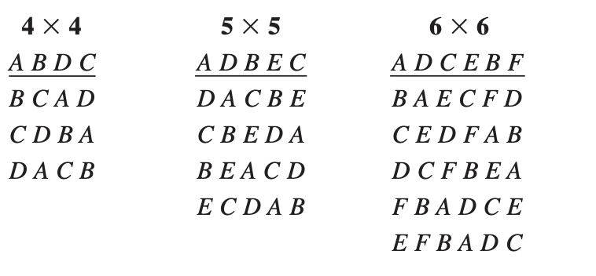

```{r setup, include=FALSE}
knitr::opts_chunk$set(echo = TRUE)
```

En el diseño en cuadro latino (DCL) se controlan dos factores de bloque y se estudia un factor de tratamientos, por lo que se tienen cuatro fuentes de variabilidad que pueden afectar la respuesta observada; éstas son: los tratamientos, el factor de bloque I (colum- nas), el factor de bloque II (renglones) y el error aleatorio. Se llama cuadro latino por dos razones: es un cuadro debido a que tiene la restricción adicional de que los tres factores involucrados se prueban en la misma cantidad de niveles, y es latino porque se utilizan letras latinas para denotar los tratamientos o niveles del factor de interés. Sean $A, B, C, ..., K,$ los k tratamientos a comparar, por lo tanto, ambos factores de bloques tienen también k niveles cada uno

**Conceptos básicos**

-   Factores: Fenómenos que potencialmente causan variación y que se pueden fijar en un valor dado.
-   Niveles: Valores que un factor puede tomar.
-   Tratamieto: Combinación de niveles de todos los factores involucrados en el experimento.
-   Variable de respuesta: Se mide el efecto del factor sobre una variable dependiente.
-   Experimento balanceado: Experimento en que todos los niveles aparecen el mismo número de veces.
-   Factor perturbador: Factor que puede tener un efecto sobre la respuesta, pero en el que no se tiene un interés particular. Puede ser: (a) desconocido y no controlable o (b) conocido y controlable.

## Bloques

A los factores adicionales al factor de interés que se incorporan de manera explícita en un experimento comparativo se les llama factores de bloque. Éstos tienen la particularidad de que se incluyen en el experimento no porque interese analizar su efecto, sino como un medio para estudiar de manera adecuada y eficaz el factor de interés. Los factores de bloque entran al estudio en un nivel de importancia secundaria con respecto al factor de interés y, en este sentido, se puede afirmar que se estudia un solo factor, porque es uno el factor de interés.

**Aspectos de los datos en un diseño en cuadro latino**

::: {style="text-align:center"}
{width="600"}
:::

El diseño de cuadrado latino se utiliza para eliminar dos fuentes de variabilidad; es decir, permite bloquear sistemáticamente en dos direcciones. Por lo tanto, las filas y columnas representan realmente dos restricciones en la aleatorización. En general, un cuadrado latino para $p$ factores, o un cuadrado latino $p × p$, es un cuadrado que contiene $p$ filas y $p$ columnas. Cada una de las $p^2$ celdas resultantes contiene una de las $p$ letras que corresponde a los tratamientos, y cada letra ocurre una y solo una vez en cada fila y columna. Algunos ejemplos de cuadrados latinos son:

::: {style="text-align:center"}
{width="393"}
:::

# Análisis de varianza (ANOVA)

Al igual que lo anteriores DOE, el análisis de varianza (ANOVA) es una técnica estadística comúnmente utilizada en experimentos de un solo factor con dos bloques aleatorizados para determinar si existen diferencias significativas entre los niveles del factor de interés en términos de su efecto sobre la variable dependiente. El ANOVA descompone la variabilidad total observada en el conjunto de datos en componentes atribuibles a diferentes fuentes de variación, como el efecto del factor, la variación entre bloques (columnas y filas) y el error.

**Objetivo:**

-   Determinar con precisión el efecto del factor de interés sobre la variable dependiente, mientras se controlan otras fuentes de variabilidad que podrían influir en los resultados.

**Componentes del ANOVA:**

-   Factor: Variable independiente que se modifica en el experimento.
-   Niveles: Categorías o valores específicos del factor.
-   Variable de respuesta: Variable dependiente que se mide en el experimento.
-   Modelo lineal: Se utiliza para describir la relación entre el factor y la variable de respuesta.
-   Suma de cuadrados total (SST): Es la variabilidad total en los datos y se calcula como la suma de las diferencias al cuadrado entre cada observación y la media general de todas las observaciones.
-   Suma de cuadrados del factor ($SS_{tratamiento}$): Representa la variabilidad entre los niveles del factor de interés y se calcula como la suma de las diferencias al cuadrado entre la media de cada nivel del factor y la media general de todos los datos, ponderada por el número de observaciones en cada nivel.
-   Suma de cuadrados de los bloques (SSB): En un cuadrado latino, los bloques se utilizan para controlar la variabilidad debida a factores no considerados que pueden afectar a la variable de interés. La suma de cuadrados del bloque representa la variabilidad entre los bloques experimentales.
-   Suma de cuadrados del error (SSE): Es la variabilidad dentro de los bloques y se calcula como la suma de las diferencias al cuadrado entre cada observación y la media de su respectivo bloque.
-   Grados de libertad: Indica el número de valores independientes en cada conjunto de datos.
-   Media cuadrática: Estima la varianza dentro y entre los grupos.
-   Razón F: Se utiliza para comparar la varianza entre los grupos con la varianza dentro de los grupos.
-   Valor p: Indica la probabilidad de obtener una razón F tan grande o más grande por casualidad.

**Interpretación de resultados:**

-   Si el valor p es menor que el nivel de significancia ($p < \alpha$), entonces se rechaza la hipótesis nula. Esto sugiere que las diferencias observadas entre los grupos son estadísticamente significativas, lo que indica que al menos uno de los grupos difiere significativamente de los demás.

-   Si el valor p es mayor que el nivel de significancia ($p ≥ \alpha$), entonces no se rechaza la hipótesis nula. En este caso, no hay evidencia suficiente para concluir que existen diferencias significativas entre los grupos comparados.

## Hipótesis

Ahora bien, el objetivo del análisis de varianza es probar la hipótesis de igualdad de los tratamientos con respecto a la media de la correspondiente variable de respuesta:

$$ H_0: \mu_1=\mu_2 = ... = \mu_n = \mu$$ $$H_1: \mu_i \neq \mu_j  \text{    para algún      } i \neq j$$ la cual se puede escribir en forma equivalente en forma de efecto como:

$$ H_0: \tau_1=\tau_2 = ... = \tau_k = 0$$ $$H_1: \tau_i \neq 0  \text{    para algún      } i$$ donde $\tau_i$ es el efecto del tratamiento $i$ sobre la variable de respuesta. Si se acepta $H_0$, se confirma que los efectos sobre la respuesta de los $k$ tratamientos son estadísticamente nulos (iguales a cero), y en caso de rechazar se estaría concluyendo que al menos un efecto es diferente de cero.

Ahora bien, si comparamos las hipótesis para la media y para los efectos se deduce que:

$$ \mu_i - \mu =\tau_i\  \ \ \ \ \ \  \ \forall i$$

Lo cual representa el efecto del tratamiento $i$,esto es la distancia entre la respuesta media del tratamiento, $\mu_i$, y la respuesta media global, $\mu$; y cuando un efecto es igual a cero, equivale a decir que la media del tratamiento correspondiente es igual a la media global. Así, se observa que para que todas las respuestas medias de tratamientos sean iguales a la respuesta media global, $\mu$, representada por la línea horizontal, se requiere que todos los efectos $\tau_i$ sean iguales a cero.

Ahora bien, para probar la hipótesis planteandas mediante la técnica de ANOVA, se debe separar la variabilidad total de los datos. Para ello se tiene que una medida de la variabilidad total presente en las observaciones.

En este sentido,la suma total de cuadrados dada por:

$$SST=\sum_{i=1}^{a}\sum_{j=1}^{n_i}y^2_{ij}-\frac{y^2_{..}}{N} $$ La suma cuadrada de tratamiento esta expresada por:

$$SS_{Tratamiento}=\frac{1}{p}\sum_{j=1}^{p}y^2_{.j.}-\frac{y^2_{...}}{N}$$ La suma cuadrada del bloque en fila: $$SS_{Bloques-fila}=\frac{1}{p}\sum_{i=1}^{p}y^2_{i..}-\frac{y^2_{..}}{N}$$ La suma cuadrada del bloque en columna: $$SS_{Bloques-columna}=\frac{1}{p}\sum_{k=1}^{p}y^2_{..k}-\frac{y^2_{...}}{N}$$ y,

$$SS_{E}=SST-SS_{Tratamiento}-SS_{Bloques-filas}-SS_{Bloques-columna} $$

Como hay un total de N observaciones, la $SST$ tiene $p^2 – 1$ grados de libertad. Hay $p$ tratamientos y $p$ bloques (filas y columnas), entonces $SS_{Tratamiento}$ y $SS_{bloques}$ tienen $p – 1$ y $p – 1$ grados de libertad, respectivamente. Finalmente, el $SS_E$ tiene $(p-2)(p-1)$ grados de libertad.

Por otra parte, las sumas de cuadrados divididas entre sus respectivos grados de libertad se llaman cuadrados medios, y es una estimación de la magnitud de su correspondiente fuente de variabilidad. Las cuatri que más interesan son el cuadrado medio de tratamientos, el cuadrado medio del bloque por fila y columnas y el cuadrado medio del error, que se denotan por:

$$MS_{tratamiento}=\frac{SS_{Tratamiento}}{p-1}$$ $$MS_{bloque-filas}=\frac{SS_{bloque-fila}}{p-1}$$ $$MS_{bloque-columna}=\frac{SS_{bloque-columna}}{p-1}$$

y, $$MS_{E}=\frac{SS_E}{(p-2)(p-1)}$$

Con base a lo anterior se construye los estadísticos de prueba como sigue:

$$F_0=\frac{MS_{tratamiento}}{MS_E}$$

$$F_0=\frac{MS_{bloques-fila}}{MS_E}$$ y,

$$F_0=\frac{MS_{bloques-columna}}{MS_E}$$

La cual sigue una distribución $F$ de fisher con $(p – 1)$ grados de libertad en el numerador y $(p-2)(p-1)$ grados de libertad en el denominador. Donde se deduce que si $F_0$ es grande, se contradice la hipótesis de que no hay efectos de tratamientos; en cambio, si $F_0$ es pequeño, se confirma la validez de $H_0$. Así, para un nivel de significancia predefinido, se rechaza $H_0$ si $F_0 > F_{ \alpha, p -1, (p-2)(p-1)}$, donde $F_{ \alpha, p -1, (p-2)(p-1)}$ es el percentil $(1 – \alpha) *100$ de la distribución F. También se rechaza $H_0$ si el $valor-p < \alpha$, donde el valor-p es el área bajo la distribución $F_{p -1, (p-2)(p-1)}$ a la derecha del estadístico $F_0$, es decir, el valor-p = $P(F > F_0)$ es la significancia observada. Las fórmulas simplificadas para calcular el estadístico $F_0$ hasta llegar al valor-p se escribe en la llamada tabla de análisis de varianza (ANOVA) que se muestra en la siguiente tabla:

::: {style="text-align:center"}
{width="581"}
:::

**Estimación de los parámetros**

A continuación presentamos los estimadores de los parámetros del modelo doe cuadrado latino:

-   Estimador de la media global:

$$ \hat{\mu} = \overline{y}_{...}$$

-   Estimador de la media del tratamiento $i$.

$$ \hat{\mu_j} = \overline{y}_{.j.}$$

-   Estimador del efecto del tratamiento $i$.

$$ \hat{\tau_j} = \overline{y}_{.j.} - \overline{y}_{...}$$

-   Estimador del efecto del bloque en fila $j$.

$$ \hat{\tau_i} = \overline{y}_{i..} - \overline{y}_{...}$$ - Estimador del efecto del bloque en columna $j$.

$$ \hat{\tau_k} = \overline{y}_{..k} - \overline{y}_{...}$$

-   Intervalo de confianza para $\mu_j$:

$$\overline{y}_{.j.} - t_{(\frac{\alpha}{2},(p-2)(p-1))}\sqrt{\frac{MS_E}{p}} \leq \mu_j \leq \overline{y}_{.j.} + t_{(\frac{\alpha}{2},(p-2)(p-1))}\sqrt{\frac{MS_E}{p}}$$

## Ejemplo 1

Un experimentador estudia los efectos que tiene cinco fórmulas diferentes en la carga propulsora de los sistemas de expulsión de un avión. Cada fórmula se analiza con un lote de materia prima que solo alcanza para tomar cinco observaciones. Las formulaciones son preparadas por varios operadores y puede haber diferencias sustanciales en las habilidades de ellos. Analice este experimento utilizando un $\alpha=0.05$.

::: {style="text-align:center"}
{width="610"}
:::

**Solución**

::: {style="text-align:center"}

:::

-   **Usando R**

Incialmente, se construye el dataframe de los datos

```{r Eje1, echo=TRUE}

#Creamos el dataframe
Resp1 <-c(24,17,18,26,22,20,24,38,31,30,19,30,26,26,20,24,27,27,23,29,24,36,21,22,31)
FILA  <-c(1,2,3,4,5,1,2,3,4,5,1,2,3,4,5,1,2,3,4,5,1,2,3,4,5)
COL   <-c(1,1,1,1,1,2,2,2,2,2,3,3,3,3,3,4,4,4,4,4,5,5,5,5,5)
TRC   <-c("A","B","C","D","E","B","C","D","E","A","C","D","E","A","B","D","E","A","B","C","E","A","B","C","D")

datos<-data.frame(Resp1,FILA ,COL,TRC)
datos$TRC <- as.factor(datos$TRC)
datos$FILA <- as.factor(datos$FILA)
datos$COL <- as.factor(datos$COL)

#Mostramos la estructura de los datos
str(datos)

head(datos)

```
Antes de iniciar la etapa de la construcción del anova, en R podemos
revisar descriptivamente si hay una diferencia entre las medias de los
niveles estudiantes y los bloques, esto es:

```{r Eje2, echo=TRUE}

## boxplots para revisar efectos
## define colors
cols <- c("#0080ff", "#ff00ff", "darkgreen", 
          "#ff0000", "orange", "#00ff00", "brown")
par(mfrow = c(1, 3))
boxplot(Resp1 ~ TRC, data = datos, las = 1,  col = cols[1:6],xlab = 'Formula', ylab = 'Carga propulsora')

boxplot(Resp1 ~ FILA, data = datos, las = 1,col = cols[1:6],  xlab = 'Bloque-fila', ylab = 'Carga propulsora')

boxplot(Resp1 ~ COL, data = datos, las = 1, col = cols[1:6], xlab = 'Bloque-columna', ylab = 'Carga propulsora')
```


Tal como se observa en el gráfico, se puede sospechar que hay diferencias entre los niveles del factor formula.

```{r Eje15, echo=TRUE}

## ANOVA including the blocking factor "block"
fit <- aov(Resp1 ~ FILA + COL + TRC, data = datos)
anova(fit)

```
La conclusión de la tabla ANOVA es que existe al menos un tipo fórmula para el que las cargas propulsoras promedio son superiores o inferiores a los demás. En otras palabras, esto indica que el factor de interés (formula) si afecta la carga propulsora. 


Ahora bien, para estimar el estimador de la media global, estimador del efecto del tratamiento $j$, y estimador del efecto del tratamiento $j$.
Se sigue lo siguiente:

```{r Eje12, echo=TRUE}

#Calculamos las medias (Estimadores por tratamiento)
## measures using tapply
with(datos, tapply(Resp1, TRC, mean))

```

```{r Eje13, echo=TRUE}

#Efectos de cada tratamiento
with(datos, tapply(Resp1, TRC, mean))-mean(datos$Resp1)

```
```{r Eje5, echo=TRUE}

#Efectos de cada bloque fila
with(datos, tapply(Resp1, FILA, mean))-mean(datos$Resp1)


#Efectos de cada bloque columna

with(datos, tapply(Resp1, COL, mean))-mean(datos$Resp1)


```

```{r Eje14, echo=TRUE}

#Media Global
mean(datos$Resp1)

```
¿Qué podemos decir acerca de la comparación de los diferentes tipos de formula? Para
responder a esto utilizamos una comparación ad hoc. Esta comparación puede hacerse utilizando la prueba de mínima diferencia significativa de Tukey:

```{r Eje17, echo=TRUE}

## Least Singificant Difference (LSD) test
anova <- aov(fit)
(lsd <- TukeyHSD(anova, "TRC", ordered = TRUE))


```
Los resultados indican que la diferencia A-B, D-B,y D-C  son estadísticamente significativas después de
correcciones por múltiples comparaciones, es decir, que la columna p-adj
es \< 0.05, donde este último valor corresponde a la probabilidad de
Error Tipo I.

Para visualizar dichas diferencias utilizamos la función plot sobre el
objeto lsd:

```{r Eje18, echo=TRUE, fig.height=10}
## LSD plot
par(mfrow = c(1, 1), mar = c(5, 6, 3, 1))
plot(TukeyHSD(anova, "TRC", ordered = TRUE), las = 1)

```


La conclusión es la misma que obtuvimos al analizar los resultados
numéricos.

Finalmente, los intervalos de confianza se pueden calcular con el
siguiente código para cada tratamiento:

```{r Eje24, echo=TRUE, fig.height=10}
## Intervalos de confianza

calcular_intervalo_confianza <- function(promedio,mse,grados_libertad,n, confianza = 0.95) {
  error_estandar <- sqrt(mse/n)
  t_valor <- qt((1 + confianza) / 2, df = grados_libertad)  # Valor crítico de t
  
  margen_error <- t_valor * error_estandar
  limite_inferior <- promedio - margen_error
  limite_superior <- promedio + margen_error
  
  return(c(limite_inferior, limite_superior))
}
fitdisplay <- lm(Resp1 ~ FILA + COL + TRC, data = datos)
resumen_modelo<-summary(fitdisplay)
mse <-resumen_modelo$sigma^2
promedio <- with(datos, tapply(Resp1, TRC, mean))
n <- 5
grados_libertad <- 12

for (i in 1:n) {
  intervalos_confianza<-calcular_intervalo_confianza(promedio[i],mse,grados_libertad,n)
  cat("Intervalo de confianza para el tratamiento", i,": [",intervalos_confianza[1],",",intervalos_confianza[2], "]\n")
}


```
# Supuestos

La validez de los resultados obtenidos en cualquier análisis de varianza
queda supeditado a que los supuestos del modelo se cumplan. Estos
supuestos son: normalidad, varianza constante (igual varianza de los
tratamientos) e independencia. Esto es, la respuesta ($Y$) en cada
tratamiento se debe distribuir de manera normal, con la misma varianza
en cada tratamiento, y las mediciones deben ser independientes. Estos
supuestos sobre $Y$ se traducen en supuestos sobre el término error
($\varepsilon$) en el modelo.Es una práctica común utilizar la muestra
de residuos para comprobar los supuestos del modelo, ya que si los
supuestos se cumplen, los residuos o residuales se pueden ver como una
muestra aleatoria de una distribución normal con media cero y varianza
constante. Los residuos, $\varepsilon_{ij}$, se definen como la
diferencia entre la respuesta observada ($y_{ij}$) y la respuesta
predicha por el modelo ($\widehat{y_{ij}}$), lo cual permite hacer un
diagnóstico más directo de la calidad del modelo, ya que su magnitud
señala qué tan bien el modelo describe los datos.

En general, En DOE de un factor al igual que los otros DOE, se tienen
los siguientes supuestos sobre el error aleatorio, $\varepsilon$:

1.  $\mu_\varepsilon= 0$, donde $\mu_\varepsilon$ es la media de $\varepsilon$. (Linealidad)

2.  $\varepsilon_1, \varepsilon_2, ... , \varepsilon_n$ tiene varianza constante $\sigma^2$ (Homocedasticidad)

3.  $\varepsilon \sim N(0,\sigma^2)$ (Normalidad)

4.  $\varepsilon_i$ y  $\varepsilon_j$ son independientes para $i \neq j$

En R dicha validación se realiza sobre los residuales del modelo ajustado. En nuestro caso, este modelo está contenido en el objeto fit.

```{r Eje20, echo=TRUE, fig.height=10,message=FALSE}
require(car)
## calcular los residuals
r <-fitdisplay$residuals

```

## Normalidad

Para la prueba de normalidad de utiliza el Q-Q plot y la prueba de
Shapiro-Wilk. En el caso del plot Q-Q se debe observar que los puntos
sigan la línea recta para comprobar la normalidad en los residuos. Para
el Caso del Test de Shapiro-Wilk se valida que $H_0:$ Los datos proceden
de una distribución normal, donde se concluye que sigue una distribución
normal si el $P-value > \alpha$.

```{r Eje21, echo=TRUE}
## Supuesto de  normalidad
shapiro.test(r)
#Graficamente
qqnorm(r, las = 1)
qqline(r, col = 1, lty = 2)
```

Para este caso en particula, se cumple el supuesto de normalidad, dado a
que p-values es igual a 0.05811 

## Homocedasticidad

Para el caso de la prueba de varianza constate (Homocedasticidad), se
utiliza el test de Barlett, Donde se valida $H_0:$ la varianza es
constante, donde se concluye qe hay homocedasticidad en los residuos si
el $P-value > \alpha$.

```{r Eje19, echo=TRUE}
## varianza constante usando Breusch-Pagan
car:::ncvTest(fitdisplay)
bartlett.test(datos$Resp1 ~ datos$TRC)
```

Para este caso en particula, se cumple el supuesto de homocedasticidad,
dado a que p-values es igual a 0.5443

## Independencia de los errores

Una prueba analítica para verificar la independencia entre residuos
consecutivos es la prueba de Durbin-Watson. Para validar el suspuesto de
independencia de errores en los residuos el $P-value > \alpha$.

```{r Eje23, echo=TRUE}
## Durbin-Watson (Prueba de independencia dee errores)
durbinWatsonTest(fitdisplay)
```

Para este caso en particula, se cumple el supuesto de independencia de
errores, dado a que p-values es igual a 0.61.

Estos resultados indican que los errores del modelo ajustado son
independientes, siguen una distribución normal y tienen varianza
constante. Por lo tanto, el modelo y las conclusiones que se deriven de
él son valida.

