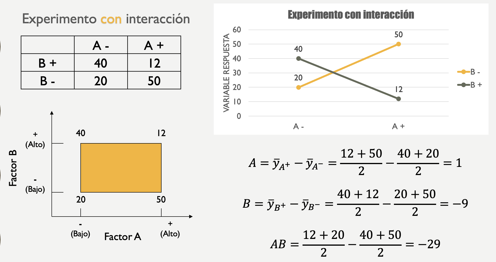

```{r setup, include=FALSE}
knitr::opts_chunk$set(echo = TRUE)
```

En las anteriores semanasse estudiaron los diseños en bloques donde sólo
se tiene un factor de tratamientos, y el resto son factores de bloques
que tienen una importancia secundaria en la investigación experimental.
El objetivo de un diseño factorial es estudiar el efecto de varios
factores sobre una o varias respuestas, cuando se tiene el mismo interés
sobre todos los factores. Por ejemplo, uno de los objetivos particulares
más importantes que frecuentemente tiene un diseño factorial es
determinar una combinación de niveles de los factores en la que el
desempeño del proceso sea mejor. Los factores pueden ser de tipo
cualitativo (máquinas, tipos de material, operador, la presencia o
ausencia de una operación previa), o de tipo cuantitativo (temperatura,
humedad, velocidad, presión, la cantidad de un cierto material, etc.).
Para estudiar la manera en la que influye cada factor sobre la variable
de respuesta, es necesario elegir al menos dos niveles de prueba para
cada uno de ellos. Con el diseño factorial completo se corren
aleatoriamente todas las posibles combinaciones que pueden formarse con
los niveles de los factores a investigar.

**Conceptos básicos**

-   Factores: Fenómenos que potencialmente causan variación y que se
    pueden fijar en un valor dado.
-   Niveles: Valores que un factor puede tomar.
-   Tratamieto: Combinación de niveles de todos los factores
    involucrados en el experimento.
-   Variable de respuesta: Se mide el efecto del factor sobre una
    variable dependiente.
-   Experimento balanceado: Experimento en que todos los niveles
    aparecen el mismo número de veces.
-   Efecto principal: Impacto en la respuesta por el cambio en un factor
    determinado a través de sus diferentes niveles.
-   Efecto de interracción: Impacto en la respuesta por el cambio de un
    factor influido por la presencia de otro.

**Generalidades del DOE factorial**

La matriz de diseño o arreglo factorial es el conjunto de puntos
experimentales o tratamientos que pueden formarse considerando todas las
posibles combinaciones de los niveles de los factores. Para afinar
ideas, si se sigue teniendo dos factores pero ahora uno tiene tres
niveles y el otro dos, se pueden construir 3 × 2 combinaciones que dan
lugar al diseño factorial 3 × 2. Observe que en el nombre del diseño
factorial va implícito el número de tratamientos que lo componen. Para
obtener el número de corridas experimentales se multiplica el número de
tratamientos por el número de réplicas, donde una de éstas se lleva a
cabo cada vez que se corre el arreglo completo. En general, la familia
de diseños factoriales $2^k$ consiste en k factores, todos con dos
niveles de prueba (los factoriales 2k se estudian con detalle en la
siguiente semana); y la familia de diseños factoriales $3^k$ consiste en
k factores, cada uno con tres niveles de prueba. Es claro que si los k
factores no tienen la misma cantidad de niveles, debe escribirse el
producto de manera explícita; por ejemplo, con k = 3 factores, el
primero con cuatro niveles y los dos restantes con dos niveles, se tiene
el diseño factorial 4 × 2 × 2.

**Efecto Principal y de interacción**

El efecto de un factor se define como el cambio observado en la variable
de respuesta debido a un cambio de nivel de tal factor. En particular,
los efectos principales son los cambios en la media de la variable de
respuesta que se deben a la acción individual de cada factor. En
términos matemáticos, el efecto principal de un factor con dos niveles
es la diferencia entre la respuesta media observada cuando tal factor
estuvo en su nivel alto, y la respuesta media observada cuando el factor
estuvo en su nivel bajo. Por ejemplo, para los datos de la siguiente
tabla, los efectos principales están dados por:

::: {style="text-align:center"}
{width="625"}
:::

Ahora, para el caso donde si haya interacción:

::: {style="text-align:center"}
{width="625"}
:::

# Análisis de varianza (ANOVA)

El análisis de varianza (ANOVA) es una técnica estadística comúnmente
utilizada en experimentos factoriales para determinar si existen
diferencias significativas entre los niveles del dos o mas factor de
interés en términos de su efecto sobre la variable dependiente. El ANOVA
descompone la variabilidad total observada en el conjunto de datos en
componentes atribuibles a diferentes fuentes de variación, como el
efecto de los factores y la interacción.

**Objetivo:**

-   Determinar con precisión el efecto de los factores de interés sobre
    la variable dependiente, mientras se controlan otras fuentes de
    variabilidad que podrían influir en los resultados.

**Componentes del ANOVA:**

-   Factores: Variables independiente que se modifica en el experimento.
-   Niveles: Categorías o valores específicos del factor.
-   Variable de respuesta: Variable dependiente que se mide en el
    experimento.
-   Modelo lineal: Se utiliza para describir la relación entre el factor
    y las variables de respuesta.
-   Suma de cuadrados total (SST): Es la variabilidad total en los datos
    y se calcula como la suma de las diferencias al cuadrado entre cada
    observación y la media general de todas las observaciones.
-   Suma de cuadrados del factor ($SS_{factores}$): Representa la
    variabilidad entre los niveles de cada factor de interés y se
    calcula como la suma de las diferencias al cuadrado entre la media
    de cada nivel del factor y la media general de todos los datos,
    ponderada por el número de observaciones en cada nivel.
-   Suma de cuadrados del interracion ($SS_{interracion}$): Representa
    la variabilidad adicional en los datos debida a las interacciones
    entre los factores. En un diseño factorial, las interacciones
    ocurren cuando los efectos de un factor sobre la variable
    dependiente varían dependiendo de los niveles de otro factor o de
    otros factores.
-   Suma de cuadrados del error (SSE): Es la variabilidad dentro de los
    bloques y se calcula como la suma de las diferencias al cuadrado
    entre cada observación y la media de su respectivo bloque.
-   Grados de libertad: Indica el número de valores independientes en
    cada conjunto de datos.
-   Media cuadrática: Estima la varianza dentro y entre los grupos.
-   Razón F: Se utiliza para comparar la varianza entre los grupos con
    la varianza dentro de los grupos.
-   Valor p: Indica la probabilidad de obtener una razón F tan grande o
    más grande por casualidad.

**Interpretación de resultados:**

-   Si el valor p es menor que el nivel de significancia ($p < \alpha$),
    entonces se rechaza la hipótesis nula. Esto sugiere que las
    diferencias observadas entre los grupos son estadísticamente
    significativas, lo que indica que al menos uno de los grupos difiere
    significativamente de los demás.

-   Si el valor p es mayor que el nivel de significancia ($p ≥ \alpha$),
    entonces no se rechaza la hipótesis nula. En este caso, no hay
    evidencia suficiente para concluir que existen diferencias
    significativas entre los grupos comparados.

**Tabla de datos**

En general, los datos para este doe tiene la siguiente forma:

::: {style="text-align:center"}
{width="625"}
:::

**Hipótesis**

Las hipótesis a probar para este DOE son las siguientes:

::: {style="text-align:center"}
{width="625"}
:::

**Ecuaciones**

Es la suma total de cuadrados dada por:

$$SST=\sum_{i=1}^{a}\sum_{j=1}^{b}\sum_{k=1}^{n}y^2_{ijk}-\frac{y^2_{...}}{abn} $$

La suma cuadrada del efecto principal A esta expresada por:

$$SS_{A}=\frac{1}{bn}\sum_{i=1}^{a}y^2_{i..}-\frac{y^2_{...}}{abn}$$ La
suma cuadrada del efecto principal B esta expresada por:

$$SS_{B}=\frac{1}{an}\sum_{j=1}^{b}y^2_{.j.}-\frac{y^2_{...}}{abn}$$

Ahora bien, para el caso del efecto de interacción, es conveniente
obtener la $$SS_{AB}$$ en dos etapas. Primero calculamos la suma de
cuadrados entre los totales de las celdas $ab$, que se llama la suma de
cuadrados debido a los "subtotales":

$$SS_{SubTotal}=\frac{1}{n}\sum_{i=1}^{a}\sum_{j=1}^{b}y^2_{ij.}-\frac{y^2_{...}}{abn}$$
Entonces, esta suma de cuadrados también contiene $SS_A$ y $SS_B$. Por
lo tanto, el segundo paso es calcular $SS_{AB}$ como:

$$SS_{AB}=SS_{SubTotal}-SS_{A}-SS_{B}$$

y finalmente,

$$SS_{E}=SST-SS_{AB}-SS_{A}-SS_{B}$$ O,

$$SS_{E}=SST-SS_{SubTotal}$$

Como hay un total de abn observaciones, la $SST$ tiene $abn – 1$ grados
de libertad. Hay $a$ niveles del factor A de interés, así que $SS_{A}$
tiene $a – 1$ grados de libertad. Hay $b$ niveles del factor B de
interés, así que $SS_{B}$ tiene $b – 1$ grados de libertad. Para el caso
de $SS_{AB}$ se tiene que hay $(a-1)(b-1)$ grados de libertad, mientras
que la $SS_E$ tiene $ab(n-1)$.

Por otra parte, las sumas de cuadrados divididas entre sus respectivos
grados de libertad se llaman cuadrados medios, y es una estimación de la
magnitud de su correspondiente fuente de variabilidad. Los cuatro que
más interesan son el cuadrado medio de factor A, factor B, la
interacción y el cuadrado medio del error, que se denotan por:

$$MS_{A}=\frac{SS_{A}}{a-1}$$ $$MS_{B}=\frac{SS_{B}}{b-1}$$
$$MS_{AB}=\frac{SS_{AB}}{(a-1)(b-1)}$$

y,

$$MS_{E}=\frac{SS_E}{ab(n-1)}$$

Con base a lo anterior se construye los estadísticos de prueba como
sigue:

$$F_0=\frac{MS_{A}}{MS_E}$$

$$F_0=\frac{MS_{b}}{MS_E}$$ y,

$$F_0=\frac{MS_{AB}}{MS_E}$$

La tabla resumen de análisis de varianza (ANOVA) que se muestra en la
siguiente tabla:

::: {style="text-align:center"}
{width="625"}
:::

## Ejemplo 1

Un ingeniero está diseñando una batería que se usará en un dispositivo
que se someterá a temperaturas extremas. Cuenta con tres opciones de
material de la placa y decide probar estos materiales con tres niveles
de temperatura: 15°F, 70°F y 125°F. Analice este experimento con un
$\alpha =0.01$.

::: {style="text-align:center"}
{width="625"}
:::

**Solución**

::: {style="text-align:center"}

:::

-   **Usando R**

Incialmente, se construye el dataframe de los datos

```{r Eje1, echo=TRUE}

library(readxl)
datos <- read_excel("data/Datos_Codigo_factorial.xlsx")

datos$Material <- as.factor(datos$Material)
datos$Temperature <- as.factor(datos$Temperature)
#Mostramos la estructura de los datos
str(datos)

head(datos)

# Cuantos datos hay?
NROW(datos)


## replicas por tratamientos
with(datos, tapply(Life, list(Material, Temperature), length))

```
Antes de iniciar la etapa de la construcción del anova, en R podemos
revisar descriptivamente si hay una diferencia entre las medias de los
niveles estudiantes y los bloques, esto es:

```{r Eje2, echo=TRUE}

## boxplots para revisar efectos

par(mfrow = c(1, 2))
boxplot(Life ~ Material, data = datos, las = 1, col = 2:4,
        xlab = 'Material', ylab = 'Battery life (hours)')
boxplot(Life ~ Temperature, data = datos, las = 1, col = 2:4,
        xlab = 'Temperature (F)', ylab = 'Battery life (hours)')


## boxplot for interactions
par(mfrow = c(1, 1))
boxplot(Life ~ Material*Temperature,
        data = datos, las = 1, col = 2:4,
        xlab = 'Material/Temperature', ylab = 'Battery life (hours)')

```
Ahora veamos la interacciones:

```{r Ej09, echo=TRUE}

## boxplots para revisar efectos

with(datos,
     interaction.plot(Material, Temperature, Life,
                      las = 1,
                      lty = 1,
                      lwd = 2,
                      col = 2:4,
                      main = "Battery life, fixed temperature")
)

## same fixing temperature
with(datos,
     interaction.plot(Temperature, Material, Life,
                      las = 1,
                      lty = 1,
                      lwd = 2,
                      col = 2:4,
                      main = "Battery life, fixed material")
)


```

Ahora, procedamos a calcular algunas medidas de tendencia central, posicion y dispersion: 

```{r Eje97, echo=TRUE}

with(datos, tapply(Life, list(Material, Temperature), mean))

with(datos, tapply(Life, list(Material, Temperature), sd))


```


Ahora construimos la tabla ANOVA incluyendo el término de interacción:

```{r Eje997, echo=TRUE}

## ANOVA con la  interaccion
fit <- lm(Life ~ Material*Temperature, data = datos)
anova(fit)


### Modelo de regression lineal
summary(fit)

```

La conclusión de este primer modelo es que la interacción entre temperature y material, definida como material:temperatura en el resultado de anova(fit), es no significativa al 1%.

Puesto que la interacción no es significativa, debemos remover este término del modelo y recalcularlo:

```{r Eje677, echo=TRUE}

## ANOVA sin interacciones
fit <- lm(Life ~ Material + Temperature, data = datos)
anova(fit)

```
La conclusion de la tabla ANOVA es que existe al menos un tipo de material para el que vida de las batería es diferente de la media global. Ademas, existe tambien un nivel de temperature para el cual el nivel de vida de las baterias difiere sustancialmente de la media global. En otras palabras, que ambos factores seleccionados influencian considerablemente la vida media de las baterias.

## Cuantificación del efecto
Ahora procedemos a determinar la la magnitud del efecto de cada nivel de material y temperatura sobre la vida media de las bater ́ıas. Esto es posible a partir del objeto fit. Para ello utilizamos los estimadores de máxima verosimilitud obtenidos al emplear el método de m ́ınimos cuadrados ordinarios en el modelo de Regresión LinealMúltiple
:
```{r Eje197, echo=TRUE}

## Least Singificant Difference (LSD) test
summary(fit)

```
A partir de este resultado concluimos que utilizar el tipo de material 3 tiene el mayor efecto sobre la vida media de las batería, mientras que trabajar a 125°C reduce hasta en 80.67 horas la vida media de la batería.


Que podemos decir acerca de la comparación de los diferentes valores de la vida de la batería. Para responder a esto utilizamos una comparación ad hoc. Esta comparación puede hacerse utilizando la prueba de mínima diferencia significativa de Tukey:

```{r Eje17, echo=TRUE}

## Least Singificant Difference (LSD) test
anova <- aov(fit)

TukeyHSD(anova, "Material", ordered = TRUE)

TukeyHSD(anova, "Temperature", ordered = TRUE)

```
Los resultados indican que la diferencia en la vida media de las baterías producidas con los materiales 3-1 es significativa. En cuanto temperaturas, todos los niveles del factor temperatura difieren entre ellos, siendo 15°C la mejor elección . Observe que la conclusión  es similar a la que obtuvimos al analizar los resultados numéricos.


# Supuestos

En general, como se ha estudiando en los anteriores modelos,en DOE factorial al igual que los otros DOE, se tienen
los siguientes supuestos sobre el error aleatorio, $\varepsilon$:

1.  $\mu_\varepsilon= 0$, donde $\mu_\varepsilon$ es la media de $\varepsilon$. (Linealidad)

2.  $\varepsilon_1, \varepsilon_2, ... , \varepsilon_n$ tiene varianza constante $\sigma^2$ (Homocedasticidad)

3.  $\varepsilon \sim N(0,\sigma^2)$ (Normalidad)

4.  $\varepsilon_i$ y  $\varepsilon_j$ son independientes para $i \neq j$

En R dicha validación se realiza sobre los residuales del modelo ajustado. En nuestro caso, este modelo está contenido en el objeto fit.

```{r Eje20, echo=TRUE, fig.height=10,message=FALSE}
## varify if car package is available
if(!require(car)) install.packages('car')
require(car)
## compute residuals
r <- rstudent(fit)
## normality assumptioms
shapiro.test(r)
##
##  Shapiro-Wilk normality test
##
## data:  r
## W = 0.97952, p-value = 0.7291
## varianza constante usando Breusch-Pagan
car:::ncvTest(fit)
## Non-constant Variance Score Test
## Variance formula: ~ fitted.values
## Chisquare = 0.107504, Df = 1, p = 0.743
## independence using Durbin-Watson
durbinWatsonTest(fit)
##  lag Autocorrelation D-W Statistic p-value
##    1     -0.08923609      2.156227   0.976
##  Alternative hypothesis: rho != 0

```
Estos resultados indican que los errores del modelo ajustado son independientes, siguen una distribución normal y tienen varianza constante. Por lo tanto, el modelo y las conclusiones que se deriven de e ́l son válidas.