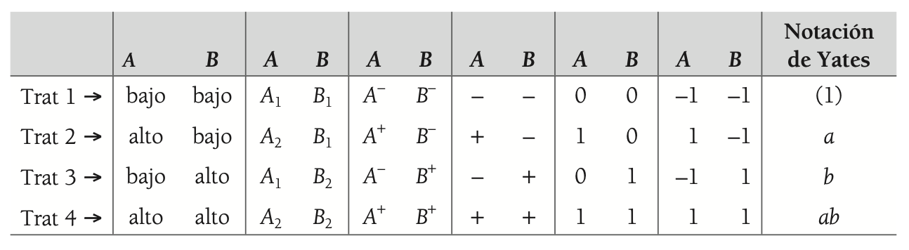
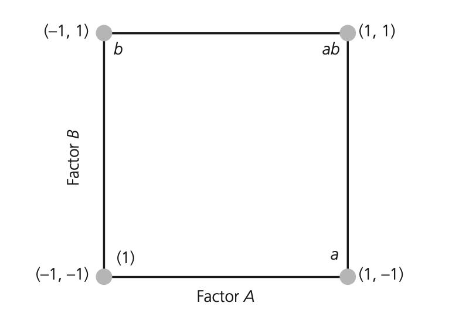
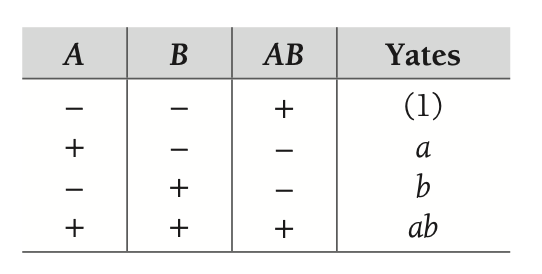
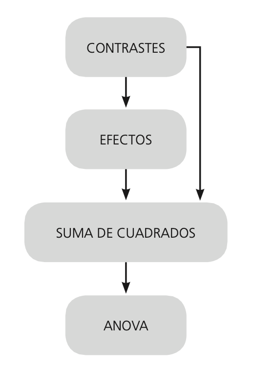
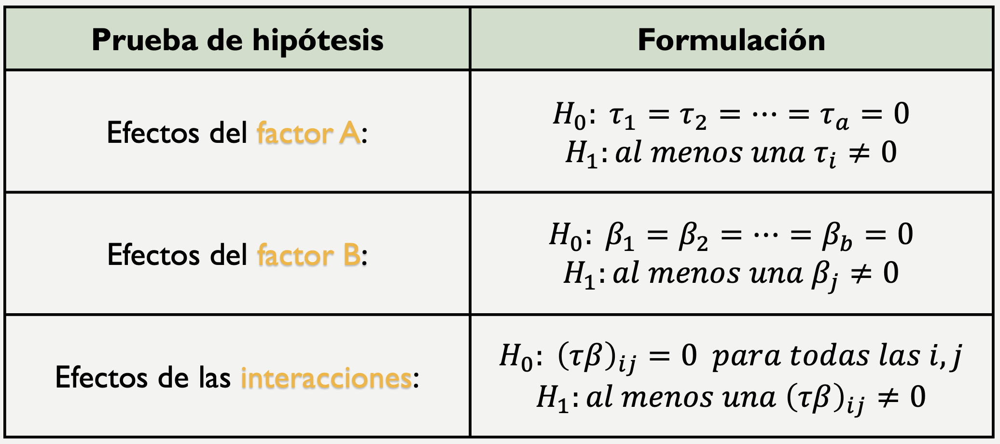
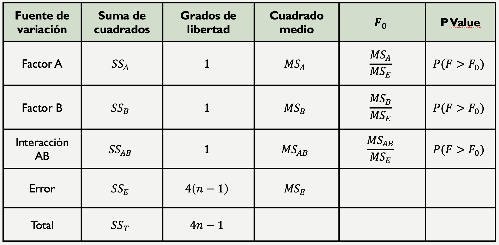
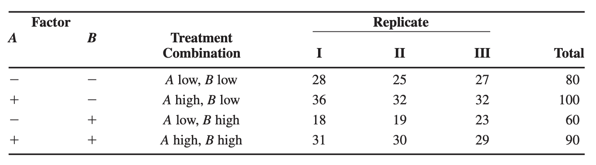
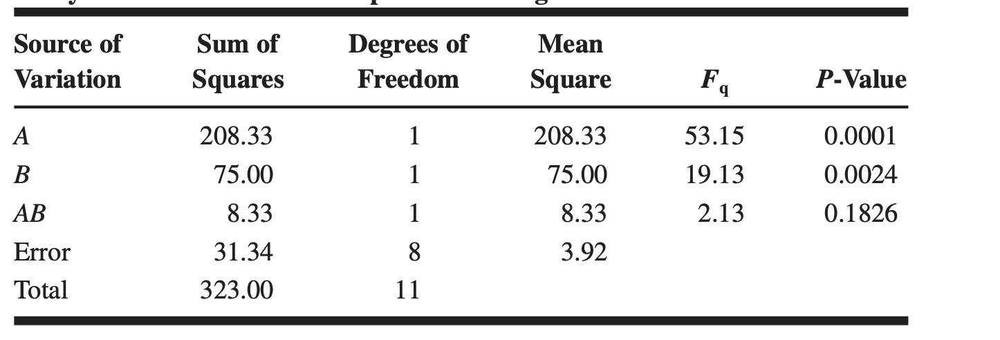

```{r setup, include=FALSE}
knitr::opts_chunk$set(echo = TRUE)
```

El diseño factorial $2^k$ es una metodología utilizada en experimentos para estudiar los efectos de múltiples factores simultáneamente. Cada factor se evalúa en dos niveles (por ejemplo, bajo y alto, o presente y ausente), y $k$ representa el número de factores involucrados. El diseño factorial completo $2^k$ implica realizar experimentos para todas las combinaciones posibles de los niveles de estos factores.

**Características Principales**

1.  **Niveles**: Cada factor tiene exactamente dos niveles, a menudo codificados como -1 (bajo) y +1 (alto).

2.  **Combinaciones**: Con $k$ factores, se tienen $2^k$ combinaciones posibles de los niveles de los factores. Por ejemplo, si $k = 3$ (tres factores), habrá $2^3 = 8$ combinaciones o experimentos diferentes.

3.  **Efectos Principales y de Interacción**:

    -   **Efectos Principales**: El impacto individual de cada factor en la respuesta.
    -   **Efectos de Interacción**: Cómo la combinación de dos o más factores afecta la respuesta, más allá de sus efectos individuales.

4.  **Análisis de Varianza (ANOVA)**: Se usa para descomponer la variabilidad total en la respuesta en componentes atribuibles a los efectos principales y de interacción, permitiendo evaluar la significancia estadística de estos efectos.

## Diseño factorial $2^2$

Con un diseño factorial $2^2$ se estudia el efecto de dos factores considerando dos niveles en cada uno. Cada réplica de este diseño consiste de 2 × 2 = 4 combinaciones o tratamientos que se pueden denotar de diferentes maneras, tal como se muestra en la siguiente tabla.

::: {style="text-align:center"}
{width="568"}
:::

Algunas de estas notaciones se utilizan en situaciones muy particulares; por ejemplo, la notación +1, –1 es útil a la hora de hacer los cálculos para ajustar por mínimos cuadrados un modelo de regresión a los datos; es la notación que utilizan los paquetes Statgraphics y Minitab. La notación de signos +, – es muy práctica para escribir las matrices de diseño; esta notación, combinada con la de Yates permite representar y calcular fácilmente los efectos de interés. La notación con letras A+, A– se utiliza para escribir, al final del análisis del experimento, el mejor punto o tratamiento ganador que se ha encontrado.

La notación de Yates [(1), a, b, ab] tiene un significado diferente a las demás: con ella se representa el total o la suma de las observaciones en cada tratamiento, más que el tratamiento mismo. Hay que observar que la lógica de la notación de Yates es la siguiente: si una letra minúscula está presente, entonces el factor correspondiente se encuentra en su nivel alto; si está ausente, el factor está en su nivel bajo; por ejemplo, ab se refiere al tratamiento en el que los factores A y B están en su nivel alto.

### Representación geométrica

El diseño factorial $2^k$ se representa de manera geométrica por los vértices de un cuadrado. Cada vértice representa un punto de diseño o tratamiento. El área limiada por este cuadrado se conoce como región experimental y, en principio, las conclusiones que se obtengan del experimento sólo tienen validez sobre esta región.

::: {style="text-align:center"}
{width="459"}
:::

### Cálculo de los efectos

En este diseño hay tres efectos de interés: los dos efectos principales (A y B) y el efecto de interacción (AB). Con el uso de la notación de Yates podemos ver que si cada tratamiento se corre n veces, entonces la media de Y en el nivel alto de A es (a + ab)/2n y en el nivel bajo es (b + (1))/2n. En este sentido, el efecto A se calcula como:

$$Efecto_A= \frac{1}{2n}[a+ab-b-(1)]$$

Y el efecto de B,

$$Efecto_B= \frac{1}{2n}[b+ab-a-(1)]$$

En la parte derecha de estas expresiones se hace evidente que los efectos son diferencias de medias. En sentido geométrico, el efecto A equivale a promediar los datos del lado derecho del cuadrado y restarles el promedio de los datos del lado izquierdo; mientras que para el efecto B se promedian los datos del lado de arriba y se le resta la media de los datos del lado de abajo.

El efecto de interacción entre los factores A y B está dado por la diferencia entre el efecto de A en el nivel alto de B y el efecto de A en el nivel bajo de B, esto es:

$$Efecto_{AB}= \frac{1}{2n}[(1)+ab-a-b]$$ 


### ANOVA

El Análisis de Varianza (ANOVA) es una técnica estadística utilizada para descomponer la variabilidad observada en un conjunto de datos en componentes atribuibles a diferentes factores y sus interacciones. En el contexto de un diseño factorial $2^K$, el ANOVA es particularmente útil para evaluar la significancia de los efectos principales de los factores y las interacciones entre ellos.

**Cálculo de Sumas de Cuadrados (SS):**

-   Suma de Cuadrados Total (SST): Mide la variabilidad total en los datos.
-   Suma de Cuadrados de los Factores (SSA, SSB, etc.): Mide la variabilidad explicada por cada factor.
-   Suma de Cuadrados de las Interacciones (SSAB, etc.): Mide la variabilidad explicada por las interacciones entre factores.
-   Suma de Cuadrados del Error (SSE): Mide la variabilidad no explicada por el modelo.

**Interpretación de resultados:**

-   Si el valor p es menor que el nivel de significancia ($p < \alpha$), entonces se rechaza la hipótesis nula. Esto sugiere que las diferencias observadas entre los grupos son estadísticamente significativas, lo que indica que al menos uno de los grupos difiere significativamente de los demás.

-   Si el valor p es mayor que el nivel de significancia ($p ≥ \alpha$), entonces no se rechaza la hipótesis nula. En este caso, no hay evidencia suficiente para concluir que existen diferencias significativas entre los grupos comparados.

### Contraste

En el contexto de un diseño factorial $2^k$, el término "contraste" se refiere a una combinación lineal específica de los efectos de los niveles de los factores. Los contrastes son útiles para probar hipótesis sobre los efectos principales y las interacciones en los experimentos factoriales. Básicamente, los contrastes nos permiten descomponer la variabilidad en los datos experimentales para identificar y cuantificar los efectos de los factores y sus interacciones. En este sentido, un contraste en un diseño $2^k$ es una suma ponderada de las medias de las respuestas en las diferentes combinaciones de niveles de los factores. Formalmente, un contraste $C$ se define como:

$$ C = \sum_{i=1}^{2^k} c_i \bar{Y}_i $$

donde:

-   $c_i$ son los coeficientes que definen el contraste.

-   $\bar{Y}_i$ es la media de las respuestas para la $i$-ésima combinación de niveles de los factores.

Para que $C$ sea un contraste válido, los coeficientes deben sumar cero:

$$ \sum_{i=1}^{2^k} c_i = 0 $$

Por ejemplo, los contrastes correspondientes a los tres efectos A, B y AB en el diseño factorial 22 están dados por:

$$Contraste_A=[a+ab-b-(1)]$$ $$Contraste_B=[b+ab-a-(1)]$$

y,

$$Contraste_{AB}=[ab+(1)-a-b]$$

Como ya hemos visto, son las cantidades que definen a los efectos. Son contrastes por el hecho de que son combinaciones lineales en las que los coeficientes suman cero (1 + 1 – 1 – 1 = 0). Una vez obte- nido el contraste, el efecto correspondiente se obtiene dividiéndolo entre la constante que lo convierta en una diferencia de medias; este número es la mitad de las observaciones hechas en el experimento. Así, en el factorial $2^k$ con n réplicas los efectos se estiman con la siguiente fórmula:

$$Efecto_A=\frac{Contraste_A}{n2^{k-1}}$$ **Métodos para calcular contrastes**

Una manera práctica de establecer los contrastes de cualquier efecto, sea principal o de interacción en el diseño factorial $2^k$ es mediante el auxilio de una tabla de signos. La tabla de signos se construye a partir de la matriz de diseño, multiplicando las columnas que intervienen en la interacción que se quiera calcular. Por ejemplo, si se quiere obtener el contraste de la interacción doble AB, se multiplica la columna de signos A por la columna B, y el resultado son los signos de contraste AB. Esto se muestra en la siguiente tabla de signos para el diseño factorial $2^2$.

::: {style="text-align:center"}
{width="431"}
:::

**Pasos para llegar al ANOVA**

Para obtener el ANOVA de forma manual, se necesita calcular la suma de cuadrados de cada uno de los efectos. Como se ilustra en la siguiente figura, las sumas de cuadrados se pueden obtener ya sea de los efectos o directamente de los contrastes.

::: {style="text-align:center"}
{width="223"}
:::

**Hipótesis**

Para investigar cuáles de los tres efectos están activos o son significativos, se procede a probar las hipótesis dadas por:

::: {style="text-align:center"}
{width="480"}
:::

Para obtener las sumas de cuadrados para cada efecto, se aplica el resultado sobre contrastes y resultan las expresiones dadas por:

$$SS=\frac{(Constraste)^2}{2^kn}$$

Luego entonces,

$$SS_A=\frac{(Constraste_A)^2}{2^kn}=\frac{[ab+a-b-(1)]^2}{4n}$$

$$SS_B=\frac{(Constraste_B)^2}{2^kn}=\frac{[ab-a+b-(1)]^2}{4n}$$

y,

$$SS_{AB}=\frac{(Constraste_{AB})^2}{2^kn}=\frac{[ab-a-b+(1)]^2}{4n}$$

Finalmente, la suma total de cuadrados dada por:

$$SST=\sum_{i=1}^{a}\sum_{j=1}^{b}\sum_{k=1}^{n}y^2_{ijk}-\frac{y^2_{...}}{4n} $$

y,

$$SS_{E}=SST-SS_{A}-SS_{B}-SS_{AB}$$ Como hay un total de abn observaciones, la $SST$ tiene $4n – 1$ grados de libertad. Hay $a$ niveles del factor A de interés, así que $SS_{A}$ tiene $a – 1$ grados de libertad. Hay $b$ niveles del factor B de interés, así que $SS_{B}$ tiene $b – 1$ grados de libertad. Para el caso de $SS_{AB}$ se tiene que hay $(a-1)(b-1)$ grados de libertad, mientras que la $SS_E$ tiene $4(n-1)$.

Por otra parte, las sumas de cuadrados divididas entre sus respectivos grados de libertad se llaman cuadrados medios, y es una estimación de la magnitud de su correspondiente fuente de variabilidad. Los cuatro que más interesan son el cuadrado medio de factor A, factor B, la interacción y el cuadrado medio del error, que se denotan por:

$$MS_{A}=\frac{SS_{A}}{a-1}$$

$$MS_{B}=\frac{SS_{B}}{b-1}$$ $$MS_{AB}=\frac{SS_{AB}}{(a-1)(b-1)}$$

y,

$$MS_{E}=\frac{SS_E}{4(n-1)}$$

Con base a lo anterior se construye los estadísticos de prueba como sigue:

$$F_0=\frac{MS_{A}}{MS_E}$$

$$F_0=\frac{MS_{b}}{MS_E}$$

y,

$$F_0=\frac{MS_{AB}}{MS_E}$$

La tabla resumen de análisis de varianza (ANOVA) se muestra en la siguiente tabla:

::: {style="text-align:center"}
{width="495"}
:::


### Modelo de Regresión Lineal

Es útil ajustar un modelo de regresión a los datos experimentales con la finalidad de predecir el valor de Y en diferentes valores de los factores estudiados.

En este sentido, el modelo de regresión en un diseño factorial $2^k$ se utiliza para cuantificar y analizar los efectos de los factores y sus interacciones en la variable de respuesta. Este enfoque permite ajustar un modelo estadístico que relaciona la respuesta con los factores experimentales, facilitando la interpretación y el análisis de los resultados.

Para un diseño factorial \( 2^k \), el modelo de regresión lineal puede expresarse de la siguiente manera:

\[ Y = \beta_0 + \sum_{i=1}^k \beta_i X_i + \sum_{i<j} \beta_{ij} X_i X_j + \ldots + \beta_{12\ldots k} X_1 X_2 \ldots X_k + \epsilon \]

donde:

*  \( Y \) es la variable de respuesta.
* \( \beta_0 \) es el intercepto.
* \( \beta_i \) son los coeficientes de los efectos principales de los factores \( X_i \).
* \( \beta_{ij} \) son los coeficientes de las interacciones de segundo orden entre los factores \( X_i \) y \( X_j \).
* \( \beta_{12\ldots k} \) es el coeficiente de la interacción de orden \( k \) entre todos los factores.
* \( \epsilon \) es el término de error aleatorio.

Para el caso del diseño factorial $2^2$, el modelo de regresión viene dado por:

\[ Y = \beta_0 + \beta_A X_A + \beta_B X_B + \beta_{AB} X_A X_B + \epsilon \]

Donde,

* $\beta_0=\bar{y}_{...}$
* $\beta_A=\frac{Efecto_A}{2}$
* $\beta_B=\frac{Efecto_B}{2}$
* $\beta_{AB}=\frac{Efecto_{AB}}{2}$

Como medida de bonda de ajuste se utiliza el R-cuadrado ajustado $R^2_{Adj}$, expresado por:

$$R^2_{adj}=1-\frac{SSE/df_E}{SS_T/df_T}$$

**Transformación de la regresión en términos de los factores**

Ahora, para efecto de calcular los valores de cada factor se hace necesario transformar el modelo de regresion de la sigueinte manera:

$$x_A=\frac{Factor_A-(FactorA_{alto}+FactorA_{bajo})/2}{(FactorA_{alto}-FactorA_{bajo})/2}$$
$$x_B=\frac{Factor_B-(FactorB_{alto}+FactorB_{bajo})/2}{(FactorB_{alto}-FactorB_{bajo})/2}$$

### Ejemplo 1

Considere la investigación del efecto de la concentración de un reactivo y de la cantidad del catalizador sobre el rendimiento de un proceso químico. La concentración del reactivo (factor A) se analizó con 15% y 25%, mientras que el catalizador (factor B) con 1 lb y 2 lb. Los datos de las observaciones se muestran en la siguiente tabla. Analice este experimento con un $\alpha=0.05$.

::: {style="text-align:center"}
{width="629"}
:::

**Solución**

::: {style="text-align:center"}
{width="455"}
:::


